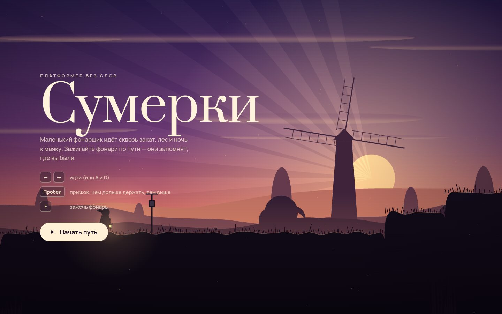

# 051 · Сумерки

> Платформер без слов: маленький фонарщик идёт сквозь закат, лес и ночь к маяку. Три уровня, ни одного слова в сюжете.

## Как запустить
Двойной клик по `index.html`. Интернет нужен только для шрифтов Prata и Manrope; игра и звук работают без сети.

## Что делать
- ← → или A / D — идти. Пробел, ↑ или W — прыжок: чем дольше держите, тем выше.
- E — зажечь фонарь. Горящий фонарь становится точкой возрождения.
- Собирайте светлячков: они летят за героем и делают его фонарь ярче.
- Esc — пауза, M — звук. На телефоне появляются сенсорные кнопки.
- Уровни: «I. Поле» (закат, мельницы), «II. Лес» (брёвна над ручьём, ветки-ступени, крошащиеся уступы, порывы ветра), «III. Маяк» (ночь, лодка, скалы под ветром с моря, подъём внутри башни).

## Что внутри
- Своя физика AABB на сетке тайлов с шагом 1/120 с: разгон и торможение, запас прыжка после края (coyote time, 0,11 с), буфер нажатия (0,13 с), переменная высота прыжка, разная гравитация на подъёме и падении.
- Односторонние доски, движущиеся платформы, которые везут героя, крошащиеся уступы с восстановлением, шипы, вода и зоны ветра с порывами.
- Мир рисуется силуэтами: пять слоёв параллакса (хребты, деревья, мельницы, мысы), туманные полосы, лучи солнца, контровой свет по кромке земли, трава под ветром, передний план.
- Небо темнеет по мере продвижения: время идёт вместе с путником. Ночью свет дают только фонари, светлячки и в финале маяк.
- Весь звук синтезирован Web Audio: ветер, прыжок, приземление, звон фонаря, треск камня.

## Почему это про Opus 5.5
Игры — одна из сильных сторон модели по тестам Every. Здесь важны не только правила, но и «ощущение»: отзывчивое управление и камера с упреждением.

## Ограничения
- Три коротких уровня, враги не предусмотрены: это прогулка с испытаниями, а не боевик.
- Геймпад не поддерживается.
