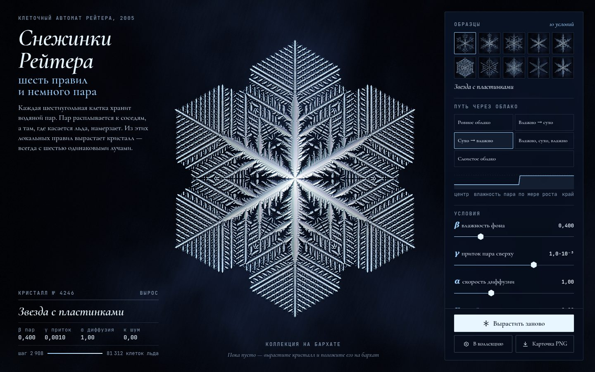

# 052 · Снежинки Рейтера

> Модель Рейтера — гексагональный клеточный автомат диффузии пара — выращивает снежинку прямо на тёмном бархате, а лёд переливается бликами вслед за курсором.

## Как запустить
Двойной клик по `index.html`. Работает без интернета (без сети шрифты заменятся системными).

## Что делать
- **Образцы** — десять условий роста с живыми миниатюрами: пластинки, дендриты, звёзды, «кружево».
- **Путь через облако** — влажность меняется по мере роста кристалла: «сухо → влажно» даёт лучи с пластинками на концах, «слоистое облако» — папоротник. Мини-график показывает β по радиусу.
- **Ползунки**: β — влажность фона, γ — приток пара сверху (логарифмическая шкала), α — скорость диффузии, κ — случайные порывы.
- **Мышь** — источник света: блики и радужная дисперсия скользят по граням. Без мыши свет медленно обходит кристалл.
- **Рейнберг** — цветное освещение, как на фотографиях снежинок под микроскопом; **Показать пар** — поле водяного пара и тёмный ореол обеднения вокруг льда.
- **В коллекцию** — кристалл ложится на бархатный лоток (хранится в браузере); **Карточка PNG** — музейная карточка с паспортом.

## Что внутри
- Модель Рейтера (2005): восприимчивые клетки копят пар (+γ), остальные диффундируют с коэффициентом α; клетка с массой ≥ 1 замерзает.
- Считается только клин 1/12 решётки (0 ≤ r ≤ q): соседи вне клина отображаются в него поворотами на 60° и отражением. Это в 12 раз быстрее и даёт идеальную симметрию даже с шумом.
- Расчёт в Web Worker (из Blob), рост ограничен по времени, чтобы его было видно (~6 с до края).
- WebGL2: клин разворачивается в RG32F-текстуру (масса пара и шаг замерзания), шейдер интерполирует по треугольникам решётки, строит нормали по «толщине» льда (старый лёд толще), добавляет блик, радужную дисперсию, свечение свежего льда, тень и процедурный бархат.
- Морфология — грубая оценка по форме: заполненность и «ветвистость» клина.
- Номер кристалла выводится из параметров: модель детерминирована, одинаковые условия дают один и тот же кристалл.

## Почему это про Opus 5.5
Настоящая научная модель, реализованная без упрощений, с неочевидной оптимизацией через симметрию, — и превращённая в предмет, на который хочется смотреть.

## Ограничения
- Модель двумерная: «толщина» льда — визуальная интерпретация накопленной массы, а не расчёт трёхмерной формы.
- Параметры β, γ, α — модельные величины, не температура и не пересыщение в физических единицах.
- Название морфологии для своих условий — эвристика, а не классификация по Накае.
