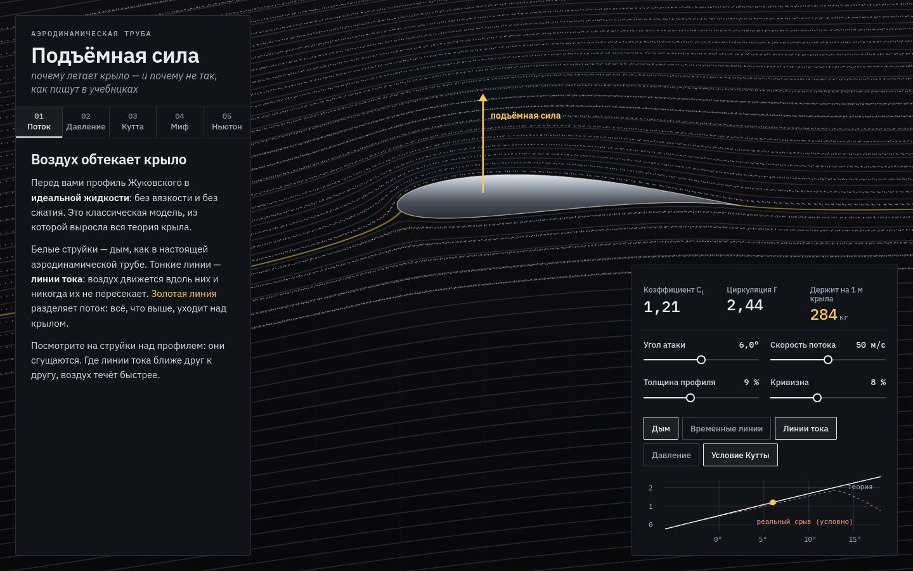

# 053 · Подъёмная сила

> Аэродинамическая труба в браузере: профиль Жуковского в потенциальном потоке, дым из тысяч частиц, карта давления, циркуляция по условию Кутты — и две частицы, которые разбивают миф о «равном времени».

## Как запустить
Двойной клик по `index.html`. Работает без интернета (без сети шрифты заменятся системными).

## Что делать
- Пять глав слева: **Поток**, **Давление**, **Кутта**, **Миф**, **Ньютон**. Каждая включает нужный вид.
- Ползунки: угол атаки (от −6° до 18°), скорость потока, толщина и кривизна профиля.
- Переключатели: дым, временные линии, линии тока, давление, условие Кутты.
- В главе «Миф» кнопка выпускает две частицы по разные стороны разделяющей линии тока и измеряет, насколько нижняя отстала.

## Что внутри
- Профиль Жуковского: окружность в плоскости ζ, проходящая через ζ = 1, и отображение z = ζ + 1/ζ. Для каждой точки экрана шейдер находит обратный образ (нужный корень квадратного уравнения), считает комплексный потенциал, скорость, коэффициент давления Cp = 1 − (V/U)² и функцию тока.
- Циркуляция по условию Кутты: Γ = 4πUR·sin(α + β); подъёмная сила — по теореме Жуковского, C_L = 2Γ/(U·c).
- Дым — до 26 000 частиц, интегрирование методом Рунге — Кутты второго порядка по той же аналитической скорости, отрисовка точками WebGL с аддитивным смешиванием.
- Разделяющая линия тока находится бисекцией по значению функции тока на поверхности профиля.
- «Держит на 1 м крыла» — ½ρV²·c·C_L для хорды 1,5 м и плотности воздуха 1,225 кг/м³, переведено в килограммы.

## Почему это про Opus 5.5
Комплексный анализ, аэродинамика и численные методы, собранные в работающий инструмент. И объяснение, которое исправляет распространённую ошибку, а не повторяет её.

## Ограничения
- Идеальная жидкость: нет вязкости, нет сопротивления (парадокс Даламбера), нет срыва потока. Срыв после ~13,5° нарисован условно и так и подписан.
- Пунктирная кривая «реального» профиля на графике — иллюстрация, а не данные продувки.
- Двумерная модель: концевых вихрей и индуктивного сопротивления нет.
