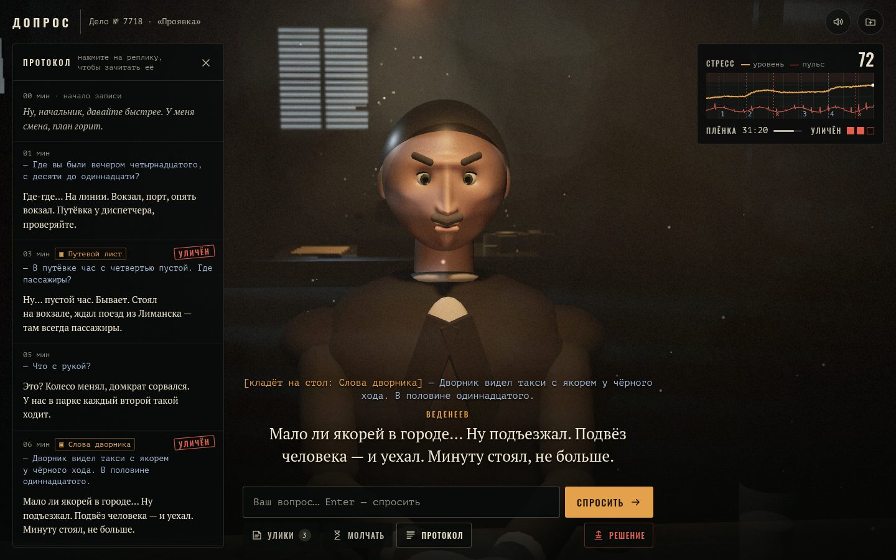

# 054 · Допрос

> Нуарная допросная в 3D: нейросеть придумывает преступление и прячет правду, а подозреваемый врёт вам в глаза — последовательно, пока его не поймают фактом.

## Как запустить
Двойной клик по `index.html`. Нужен интернет: three.js грузится с CDN, а дело и ответы подозреваемого пишет DeepSeek (через OpenRouter по вашему ключу — BYOK: окно подключения появится при первом «Взять новое дело»).

Без ключа или без сети работает демо-дело «Проявка» с заготовленными ответами (вверху метка «демо-режим — нейросеть не подключена»). Если не загрузился CDN, допрос идёт без 3D-комнаты, текстом.

## Что делать
- **«Взять новое дело»** — нейросеть сочиняет дело: обычно 1–2 минуты, с ключом первое начинает готовиться сразу при открытии страницы. Пока ждёте, можно сыграть **«Проявку»** — новое дело дождётся в меню. **«Готовое дело «Проявка»»** — без ожидания, с ключом его подозреваемый тоже отвечает вживую.
- Пишите вопросы свободным текстом, **Enter** — спросить. Реплики печатаются потоком, пока подозреваемый говорит.
- **«Улики»** — выбрать карточку и положить её на стол вместе с вопросом. Новые улики приносят по ходу: стук в дверь.
- **Клик по реплике в протоколе** — зачитать ему его же слова.
- **«Молчать»** — промолчать и смотреть на него.
- **«Решение»** — обвинить или отпустить. Плёнки 45 минут; когда кончится, решать придётся.
- В финале стекло становится прозрачным: правда, опоры его легенды (когда сказал, когда и чем выбили), протокол с пометками, где он врал, и эпилог.

## Что внутри
- **Дело с рассуждением.** `AI.json` с `think: true` пишет правду, легенду из четырёх опор-лжи, пять улик от слабой к сильной (у каждой — какие опоры она опровергает), признание и первую реплику. Игра задаёт «семя» — место, преступление, профессию, возраст, виновен ли и внешность — и проверяет ответ по схеме: битые поля отбрасываются, id перенумеровываются.
- **Правда живёт в JS.** Она уходит модели только в system-промпт подозреваемого вместе с правилами игры. Каждый ход — строгий JSON: `exposed`, `admit`, `told`, `confession`, `stress`, `mood`, `gesture`, затем `line`. Служебные поля идут первыми, поэтому лицо реагирует раньше слов, а реплика выдирается из недописанного JSON и печатается потоком.
- **Память и последовательность.** Модели уходит вся история допроса. Отдельно учитывается, какие опоры он уже произнёс: улика бьёт только по сказанной лжи, а показанная слишком рано — подсказка лжецу. Ломается, только когда уличён в трёх опорах из четырёх; угрозы без фактов его не ломают, а невиновного можно запугать до оговора.
- **Сцена на three.js.** Лампа-маятник с тенями, конус света с дымом и пылью, одностороннее зеркало со своим шейдером, полосы от жалюзи. Подозреваемый собран из примитивов: IK рук, взгляд, моргание, брови, рот по буквам. Стресс двигает анимацию — пот, дыхание, барабанящие пальцы, бегающий взгляд, камера подъезжает ближе.
- **Интерфейс.** Самописец с двумя перьями (уровень стресса и пульс, метки вопросов и разоблачений), плёнка магнитофона, протокол, бумажные карточки улик. Звук целиком на Web Audio: вытяжка, дождь, стук, щелчки магнитофона, аккорд разоблачения.

## Почему это про Opus 5.5
Игра — это договор между кодом и моделью: код хранит правду, выдаёт улики и считает разоблачения, а модель сначала с рассуждением сочиняет загадку, а потом в роли подозреваемого врёт по ней последовательно, отвечая строгим JSON. Сломанный ответ не ломает партию: битое поле заменяется разумным значением.

## Ограничения
- Судьбу разоблачения решает модель по правилам из промпта. Код проверяет схему, отсекает разоблачения молчанием и считает порог, но спорные случаи («это факт или догадка?») остаются на совести модели.
- Дело с рассуждением пишется 1–3 минуты (в проверке — 78 с в одном прогоне и больше 160 с в другом). Если рассуждение идёт дольше 90 с, параллельно пишется запасное дело без рассуждения и берётся то, что готово первым. Первое дело начинает готовиться при открытии страницы, следующее — пока вы читаете финал.
- Стоимость: дело с рассуждением ≈ $0,005, ход допроса ≈ $0,0003–0,0006 (растёт с историей), партия на 20 вопросов — около цента-двух. Счётчик вверху считает то, что вернул OpenRouter; оборванный по таймауту запрос в него не попадает.
- Подозреваемый собран из примитивов: это стилизация, а не реалистичный человек. Голоса нет — реплики субтитрами.
- Демо-режим понимает вопросы по ключевым словам и знает только дело «Проявка».
- Город, люди и события вымышлены; время действия — конец 1970-х, детали эпохи условны.
