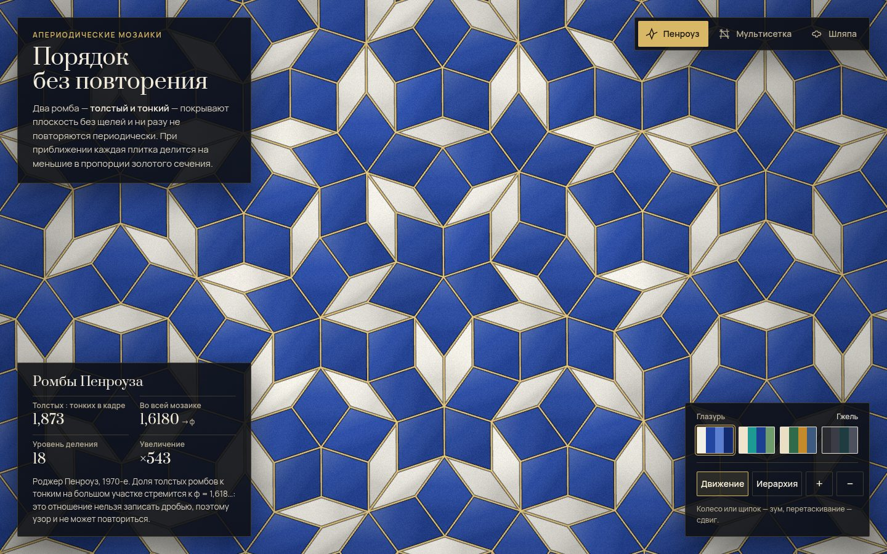

# 055 · Апериодическая мозаика

> Порядок без повторения: ромбы Пенроуза с бесконечным зумом, мультисетка де Брёйна, где плитки перещёлкиваются на глазах, и «шляпа» — плитка-одиночка, открытая в 2023 году. Всё в глазурованной керамике с золотыми швами.

## Как запустить
Двойной клик по `index.html`. Работает без интернета (без сети шрифты заменятся системными).

## Что делать
- **Пенроуз** — мозаика медленно «дышит»: приближается к центру пятилучевой симметрии и отдаляется, плитки делятся на меньшие с плавным проявлением новых швов.
- **Мультисетка** — симметрия 10, 14, 8 (Амман — Бенкер) или 12 порядка. Сетки дрейфуют, и плитки перещёлкиваются. Наведите курсор на ромб — подсветятся две «ленты», которым он принадлежит.
- **Шляпа** — зеркальные шляпы выделены цветом; «Иерархия» показывает метатайлы H, T, P, F, из которых собирается узор.
- Колесо или щипок — зум к курсору, перетаскивание — сдвиг, «+» и «−» на клавиатуре. «Движение» включает и выключает автопилот.
- Четыре глазури: «Гжель», «Изник», «Изразец», «Кинцуги».

## Что внутри
- **Пенроуз P3**: подстановки на треугольниках Робинсона. Дерево делится только там, где треугольник попадает в кадр, поэтому глубина зума ограничена лишь точностью чисел (десятки уровней). Половинки склеиваются в ромбы по общему основанию. Два соседних уровня смешиваются по дробной части глубины.
- **Мультисетка**: для каждой пары семейств прямых и каждой точки их пересечения строится ромб по формуле де Брёйна; при Σγ = 0 и пяти сетках получается настоящий Пенроуз. Плитки отслеживаются по ключу — появившиеся проявляются, исчезнувшие гаснут.
- **Шляпа**: метатайлы H, T, P, F по схеме Крейга Каплана, шесть уровней подстановки, отсечение невидимых поддеревьев по описанным окружностям.
- Проверено численно при разработке: в растре шляп нет ни одного пикселя наложения, доля зеркальных шляп — 0,1272 при теоретической 1/(1 + φ⁴) ≈ 0,1273.
- Статистика в углу считается по плиткам в кадре: отношение толстых ромбов к тонким стремится к φ.

## Почему это про Opus 5.5
Математика из свежей статьи, воспроизведённая без ошибок: правильность проверена вычислением, а не на глаз. Плюс сдержанная работа со стилем.

## Ограничения
- Классическую пару «воздушные змеи и дротики» (P2) в этой версии не показываем: ромбы P3 и мультисетка передают ту же идею.
- Зум Пенроуза ограничен ~50 уровнями деления из-за точности double.
- Мозаика «шляпа» — конечный участок шестого уровня подстановки: на краю можно выйти за пределы узора.
