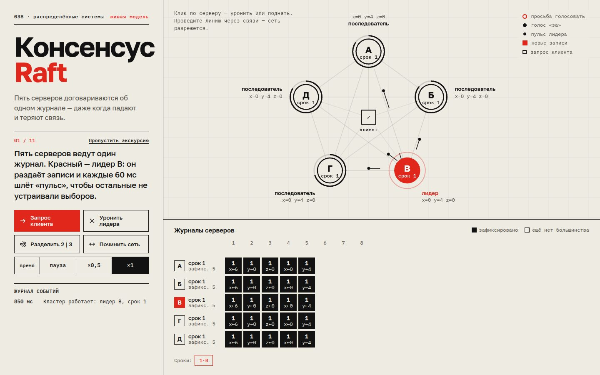

# 056 · Консенсус Raft

> Пять серверов договариваются об одном журнале: выбирают лидера, реплицируют записи, фиксируют их большинством — и переживают падения и разрезанную сеть.

## Как запустить
Двойной клик по `index.html`. Интернет нужен только для шрифтов.

## Что делать
- Смотреть **экскурсию** из одиннадцати шагов: лидер, запись, падение лидера, выборы, возвращение, разделение сети, стирание незафиксированной записи. «Пропустить экскурсию» — сразу к свободной игре.
- **Клик по серверу** роняет или поднимает его. **Клик по клиенту** в центре отправляет запись.
- **Провести линию по схеме** — разрезать сеть: связи, которые она пересекает, перестают доставлять сообщения.
- Кнопки: запрос клиента, уронить лидера, разделить сеть 2 | 3, починить сеть, скорость времени.

## Что внутри
- Честная реализация Raft по статье Онгаро и Остераута: сроки, голосование с проверкой актуальности журнала, AppendEntries с prevLogIndex/prevLogTerm, откат nextIndex при несовпадении, фиксация только записей своего срока.
- Дискретно-событийная симуляция: у каждого сообщения своя задержка 22–52 мс модельного времени, таймеры выборов случайны в диапазоне 150–300 мс, пульс лидера — каждые 60 мс.
- Клиент по-настоящему ищет лидера: последователь отвечает перенаправлением, при тишине клиент повторяет запрос.
- Упавший сервер теряет только изменчивое состояние (commitIndex, машину состояний), а срок, голос и журнал сохраняются — как на диске.
- Таблица журналов внизу показывает зафиксированные и незафиксированные записи, стирание конфликтующих записей подсвечено красным.

## Почему это про Opus 5.5
Распределённый протокол с десятками краевых случаев, написанный с нуля и работающий без подгонки под сценарий: экскурсия лишь нажимает те же кнопки, что и пользователь.

## Ограничения
- Нет снимков состояния (snapshot) и смены состава кластера.
- Клиентские запросы могут записаться дважды при повторе — в настоящих системах их отсекают по идентификатору клиента, здесь дубли отсекаются только внутри журнала лидера.
- Время модельное: 1 секунда экрана ≈ 110 мс работы кластера.
