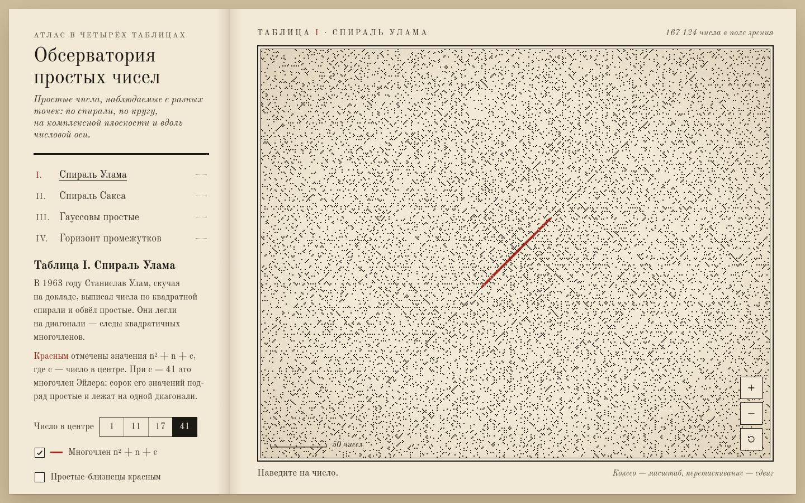

# 057 · Обсерватория простых чисел

> Атлас в четырёх таблицах: простые числа по квадратной и архимедовой спирали, на комплексной плоскости и вдоль числовой оси — до 33 554 432.

## Как запустить
Двойной клик по `index.html`. Интернет нужен только для шрифта Old Standard TT; без него всё работает на запасном Times.

## Что делать
- Слева — оглавление атласа: «I. Спираль Улама», «II. Спираль Сакса», «III. Гауссовы простые», «IV. Горизонт промежутков» (или клавиши 1–4).
- Колесо и щипок — масштаб, перетаскивание — сдвиг, двойной клик — приблизить, 0 — вернуть вид.
- Наведите на число: простое покажет свой номер («№ 252 по счёту»), составное — разложение на множители. На гауссовой плоскости 5 разложится в (2 + i)(2 − i).
- Таблица I: число в центре спирали 1, 11, 17 или 41. При 41 сорок значений многочлена Эйлера n² + n + 41 встают в одну красную диагональ.
- Таблица IV: логарифмическая или линейная шкала, средний промежуток ln n, граница Крамера (ln n)², рекорды. Ниже — отношения π(x) : (x / ln x) и π(x) : Li(x).

## Что внутри
- Сегментированное решето Эратосфена в Web Worker (Blob): 2²⁵ чисел, 1 бит на нечётное, сегменты по 2 млн. Таблицы рисуются, пока решето досчитывает.
- Префиксные суммы по блокам из 512 нечётных дают π(n) за микросекунды. Блоки хранят свой максимальный промежуток — поэтому «горизонт» строится мгновенно на любом масштабе.
- Обратная функция спирали Улама (x, y) → n: каждый пиксель знает своё число без обхода спирали. При мелком масштабе — попиксельный рендер с подвыборкой, при крупном — точки «оттиска», числа и путь спирали.
- Li(x) — ряд Рамануджана. Рекорды промежутков считаются самим решетом, а не берутся из таблицы.
- Бумажная фактура, волокна и виньетка — процедурные.

## Почему это про Opus 5.5
Точная теория чисел, быстрый код и продуманная типографика в одной вещи: всё, что показано, посчитано на месте и проверяемо наведением мыши.

## Ограничения
- Верхняя граница — 33 554 432: выше решето в браузере стало бы слишком тяжёлым.
- Числа за пределами просеянного показаны серым «ещё не просеяно».
