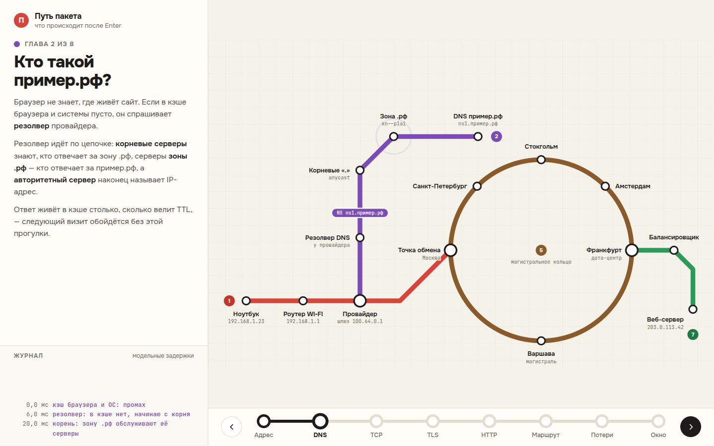

# 058 · Путь пакета

> Что происходит после Enter в адресной строке: DNS, рукопожатия TCP и TLS 1.3, HTTP, маршрут, потери и окно перегрузки. Сеть нарисована как схема метро, пакеты ездят как поезда.

## Как запустить
Двойной клик по `index.html`. Работает без интернета, только шрифты станут системными.

## Что делать
- Внизу — ветка из восьми «станций»-глав: Адрес → DNS → TCP → TLS → HTTP → Маршрут → Потери → Окно. Кнопки или стрелки ← → переключают главы, каждая проигрывает свою сцену на схеме.
- **Адрес**: впишите любой кириллический домен — увидите его Punycode (`пример.рф → xn--e1afmkfd.xn--p1ai`).
- **Потери**: «Уронить ещё раз» — пакет выбрасывается в переполненной очереди, три дублирующих ACK запускают быстрый повтор.
- **Окно**: ползунки RTT и доли потерь меняют «пилу» окна перегрузки и скорость. Рядом — формула Матиса.
- Журнал слева пишет события с модельными задержками.

## Что внутри
- Punycode (RFC 3492) реализован с нуля и сверен с эталонами (`пример.рф`, `münchen.de`, `bücher.example`).
- Схема: четыре линии — домашняя, DNS, магистральное кольцо (Москва → Варшава → Франкфурт) и линия дата-центра. Поезда едут по ломаным маршрутам с плавным разгоном и торможением.
- Главы — асинхронные сценарии; при переключении старый сценарий тихо завершается.
- Окно перегрузки — модель в духе Reno: медленный старт, рост на сегмент за RTT, деление пополам при потере.
- Факты проверены: скорость света в волокне около 200 000 км/с, TLS 1.3 договаривается о ключах за 1 RTT, быстрый повтор после трёх дублей ACK, адрес 203.0.113.42 — из диапазона для документации.

## Почему это про Opus 5.5
Ясное объяснение сложной системы: каждая глава начинается с главного, а схема и журнал показывают то же самое, что написано в тексте.

## Ограничения
- Задержки в журнале — модельные, а не измеренные.
- Модель окна упрощена: современный Linux по умолчанию использует CUBIC, а не Reno.
- Маршрут и узлы магистрали — иллюстрация, а не реальная топология.
