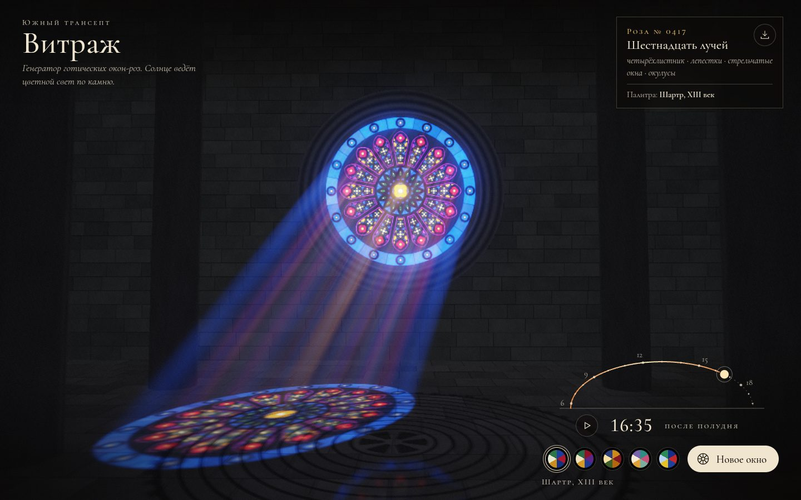

# 059 · Витраж

> Генератор готических окон-роз: солнце идёт по небу, и цветной свет ползёт по каменному полу собора.

## Как запустить
Двойной клик по `index.html`. Интернет нужен только для шрифта Cormorant; без него текст наберётся запасным Georgia, сцена работает полностью.

## Что делать
- Тяните солнце по дуге справа внизу — меняется время суток. Утром пятно света лежит правее, к вечеру уползает влево и вытягивается.
- Нажмите на кусок стекла — он и все симметричные ему куски перекрасятся в следующий цвет палитры.
- «Новое окно» (клавиша N) собирает новую розу — от центра к краю.
- Палитры эпох: Шартр, Сент-Шапель, Прага, Модерн, Реймс (клавиши 1–5).
- Колесо мыши или двойной тап — подойти ближе к окну. Пробел — остановить солнце, S — сохранить кадр в PNG.

## Что внутри
- Роза рисуется на Canvas 2D трижды: цвет стекла, карта материалов (стекло, камень, свинец) и карта номеров кусков для клика. Стрельчатые арки строятся дугами с центрами на линии пят, четырёхлистники — внешним контуром объединения окружностей; по кругу — от 8 до 24 лучей.
- Сцена — один полноэкранный шейдер WebGL2: пол, стена и колонны пересекаются аналитически. Свет в точку приходит, если луч к солнцу проходит сквозь стекло и не задевает колонну; тени колонн мягкие, как от настоящего солнечного диска.
- Объёмные лучи — марширование вдоль луча камеры с 3D-шумом плотности пыли и фазовой функцией Хеньи — Гринстейна. Пятно на полу размывается с расстоянием от окна.
- Накопление кадров гасит шум лучей; свечение (bloom) — каскад уменьшения и увеличения, тональная кривая ACES.
- Окно отражается в полированном полу по формуле Френеля; на полу — инкрустированный лабиринт.

## Почему это про Opus 5.5
Геометрия готического трасери, оптика и интерфейс собраны в одну 3D-сцену — это тот класс визуальных задач, в которых модель сильна. Вёрстку и свет модель довела по собственным скриншотам.

## Ограничения
- Солнце идёт по упрощённой дуге (азимут ±40°, высота до 52°), без учёта широты и времени года.
- Стекло не рассеивает свет внутри себя, откосы окна условны.
- На слабой видеокарте разрешение сцены снижается автоматически.
