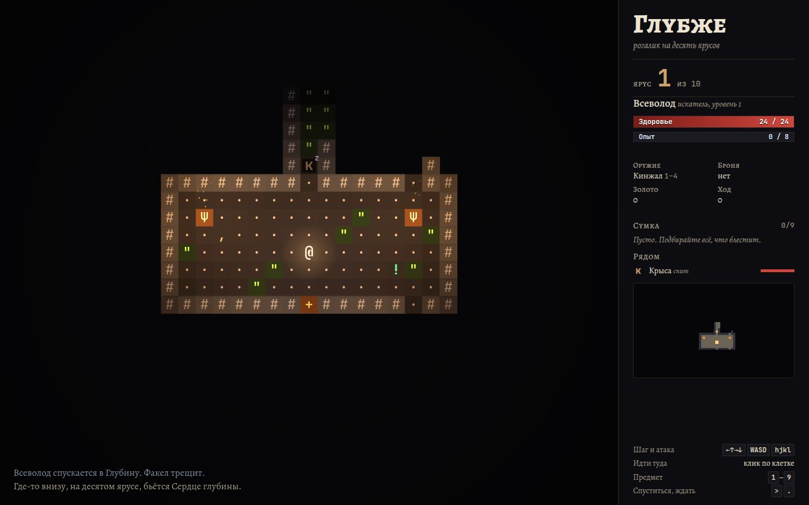

# 060 · Глубже

> Рогалик на десять ярусов: факел, жаровни, кристаллы и лава освещают подземелье цветным светом, монстры ведут себя по-разному, а после смерти игра пишет эпитафию по истории вашего забега.

## Как запустить
Двойной клик по `index.html`. Работает без интернета (без сети шрифты заменятся системными).

## Что делать
- **Стрелки, WASD, hjkl и yubn, цифровой блок** — шаг; шаг в монстра — атака.
- **Клик по клетке** — идти туда по разведанной карте; путь прерывается, если появился новый враг.
- **1–9** — выпить зелье или прочитать свиток из сумки; **>** или Enter на лестнице — спуститься; **.** или пробел — ждать.
- На телефоне — экранный крест, центральная кнопка «ждать» (на лестнице — спуститься).
- Цель: на десятом ярусе одолеть Хранителя глубины и поднять Сердце глубины.

## Что внутри
- Ярусы генерируются заново: комнаты с коридорами и дверями (BSP-деление) на верхних уровнях, пещеры клеточным автоматом ниже, с шестого яруса — лава, и она никогда не перекрывает путь к лестнице (проверка поиском в ширину).
- Поле зрения — рекурсивный shadowcasting по восьми октантам. Свет: факел героя, жаровни, кристаллы, лава и свитки света, каждый с учётом теней. Освещённые залы видно издалека.
- Монстры — кириллические буквы со своим поведением: крысы и летучие мыши мечутся, лучники держат дистанцию и стреляют, слизни делятся от ударов, призраки проходят сквозь стены, тролли регенерируют, Хранитель призывает стаю. Погоня идёт по карте расстояний Дейкстры.
- Зелья и свитки не опознаны до первого применения: «лазурное зелье» может оказаться лечением, а может — огнём.
- Эпитафия собирается из истории забега с согласованием по роду и падежам: «Одолела 12 крыс, 3 гоблина и одного тролля. Пала от стрелы гоблина-лучника».

## Почему это про Opus 5.5
Много взаимосвязанных систем (генерация, свет, ИИ, предметы, баланс) в одном файле, и всё работает вместе. Плюс литературный слой на правильном русском.

## Ограничения
- Сохранения нет: смерть окончательна, как положено рогалику. В браузере хранится только рекорд глубины.
- Баланс настроен на короткий забег (20–40 минут), а не на долгую кампанию.
