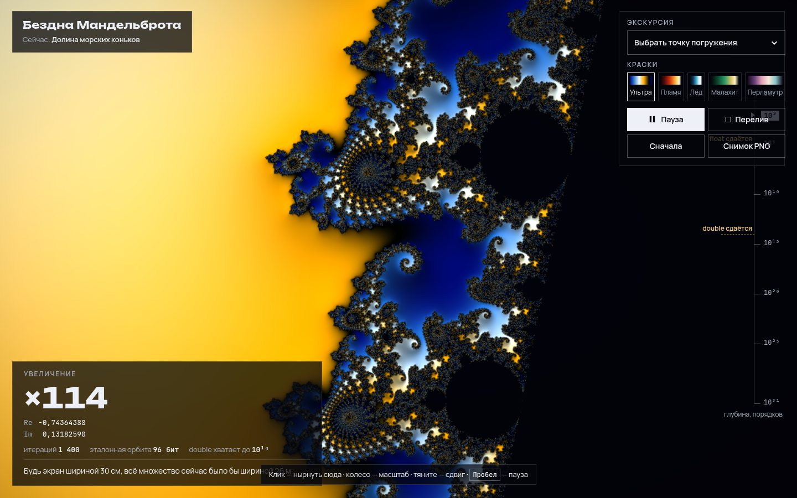

# 061 · Бездна Мандельброта

> Автопилот сам выбирает самые «глубокие» места и ныряет в множество Мандельброта до увеличения 10³¹ — туда, где обычная точность чисел кончилась ещё на 10¹⁴.

## Как запустить
Двойной клик по `index.html`. Нужен браузер с WebGL2 и float-текстурами (любой современный Chrome, Safari, Firefox на Mac). Шрифты грузятся с Google Fonts; без сети подставятся системные.

## Что делать
- Смотреть: автопилот ныряет сам, счётчик слева показывает увеличение и координаты центра с нужным числом знаков.
- **Клик** — нырнуть в выбранную точку; **колесо** — масштаб; **перетаскивание** — сдвиг; **пробел** — пауза.
- **Экскурсия** — пять точек погружения: долины морских коньков и слонов, тройная спираль, минибрат на игле и дендрит в точке c = i — там множество самоподобно, и зум бесконечен.
- **Краски** — пять палитр; **Перелив** — палитра медленно течёт; **Снимок PNG** — сохранить кадр.

## Что внутри
- **Теория возмущений.** Центр кадра хранится как число с фиксированной точкой на BigInt (256 бит). Эталонная орбита Z считается в Web Worker с точностью, подобранной под глубину. Каждый пиксель в шейдере считает только малое отклонение δ: δ′ = 2Zδ + δ² + δc — ему хватает float32.
- **Перебазирование (rebasing).** Когда |Z + δ| < |δ| или эталон кончился, пиксель продолжает с Z₀ = 0. Это убирает «глитчи» без вторичных эталонов.
- **Данные отдельно от цвета.** Сглаженное число итераций, оценка расстояния и нормаль пишутся во float-текстуру. Раскраска, рельеф и перелив палитры — отдельный дешёвый проход.
- **Автопилот.** Маленькая «проба» 72×44 рендерится на GPU и читается асинхронно через PBO и fence. Цель — самый долгий сбежавший пиксель у центра, лимит итераций растёт следом за глубиной.
- **Прогрессивное уточнение.** В движении кадр считается в пониженном разрешении с подстройкой под частоту кадров, в покое — дорисовывается полосами в полном.

## Почему это про Opus 5.5
Сочетание математики (возмущения, перебазирование, оценка расстояния) и системной инженерии (BigInt в воркере, асинхронное чтение с GPU, адаптивный рендер) — длинная задача, где ошибка в любом звене видна глазом.

## Ограничения
- Предел — около 10³¹: дальше отклонения пикселей меньше минимального float32. Для большей глубины нужна арифметика с расширенной экспонентой.
- Автопилот выбирает цель эвристикой. Иногда он уходит в скучную область, тогда помогает клик по интересному месту.
- На больших глубинах лимит итераций доходит до десятков тысяч, и кадр считается заметно медленнее: зум замедляется сам.
- Точки экскурсии, кроме c = i, заданы как стартовые области, а не точные координаты: дальше ведёт автопилот.
