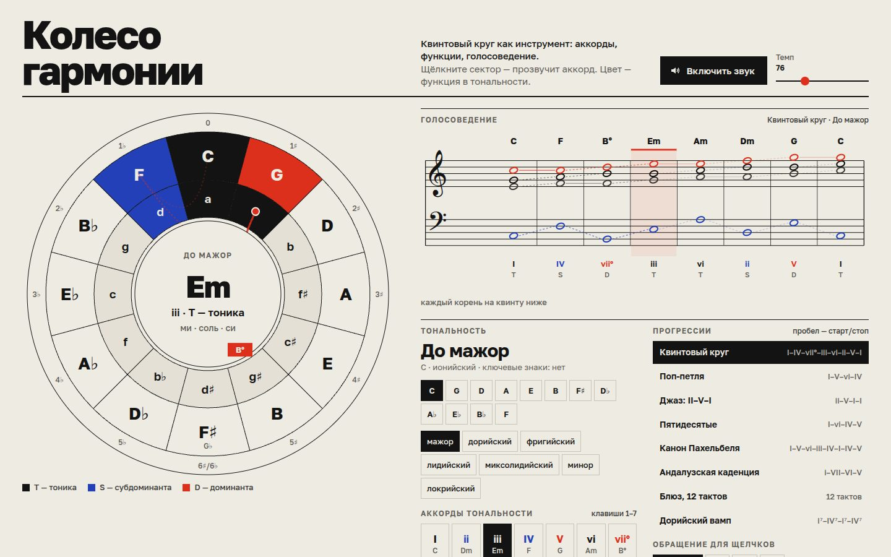

# 062 · Колесо гармонии

> Квинтовый круг как музыкальный инструмент: аккорды, лады, функции тоники, субдоминанты и доминанты, голосоведение на нотном стане и клавиатуре.

## Как запустить
Двойной клик по `index.html`. Звук включается кнопкой «Включить звук» или первым щелчком по аккорду — так требуют браузеры. До этого прогрессия идёт беззвучно. Интернет нужен только для шрифтов (Golos Text и нотный Noto Music).

## Что делать
- Щёлкнуть сектор круга: внешнее кольцо — мажорные трезвучия, внутреннее — минорные. `Shift`+щелчок делает сектор новой тоникой.
- Цвет сектора — функция аккорда в тональности: чёрный — Т, синий — S, красный — D. Уменьшённое трезвучие VII ступени отмечено плашкой внутри круга.
- Прогрессии справа: «Квинтовый круг», «Поп-петля», «Джаз: II–V–I», «Канон Пахельбеля», «Андалузская каденция», «Блюз, 12 тактов» и другие. Красная линия на круге рисует путь гармонии.
- Нотный стан показывает четыре голоса целыми нотами, линии связывают один голос от аккорда к аккорду. Под станом — римские цифры и функции.
- Клавиатура: `1–7` — аккорды ступеней, `A S D F G H J K` и `W E T Y U` — ноты, пробел — старт и стоп. Над клавишами дуги показывают, куда перешёл каждый голос.
- Лад меняется одной кнопкой (ионийский, дорийский… локрийский) — вместе с ним меняются функции и раскраска круга.

## Что внутри
- Ноты хранятся как «буква + альтерация», а не как номер клавиши. Поэтому энгармоника честная: в фа-диез мажоре есть E♯, а полууменьшённый на B♭ пишется как B♭–D♭–F♭–A♭.
- Лады получаются поворотом мажорной гаммы; ключевые знаки берутся от родительского мажора.
- Голосоведение — перебор расположений баса и трёх верхних голосов. Выигрывает вариант с наименьшим суммарным движением, штрафами за параллельные квинты и октавы, за большие скачки сопрано и удвоение терции. Если параллели всё же остались, под станом появится предупреждение.
- Звук — самодельное «фортепиано»: шесть синусоид с лёгкой негармоничностью, затухание, зависящее от высоты, щелчок молоточка, свёрточная реверберация со сгенерированной импульсной характеристикой.

## Почему это про Opus 5.5
Задача на стыке дисциплин: музыкальная теория, оптимизация, цифровой звук и швейцарская типографика, собранные в инструмент, которым можно играть.

## Ограничения
- Голосоведение оптимизирует каждый переход по отдельности, без поиска по всей прогрессии.
- Для 6♯/6♭ показано написание F♯ (d♯-moll), вариант G♭ подписан мелко.
- Звук синтезирован и не заменяет сэмплированный рояль.
