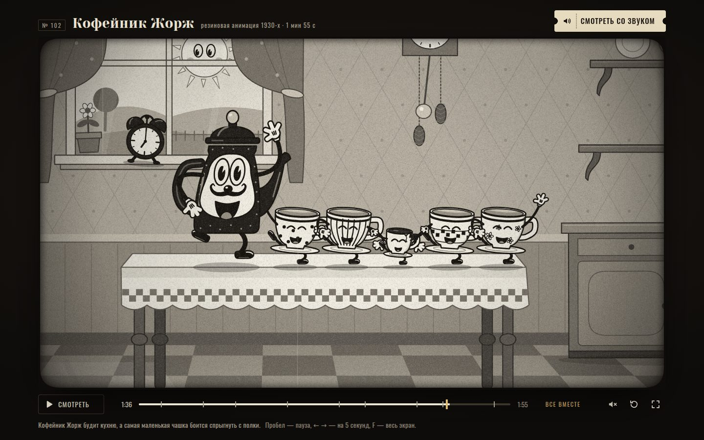

# 063 · Кофейник Жорж

> Кофейник Жорж будит кухню и пускает её в пляс под регтайм, а самая маленькая чашка боится спрыгнуть с полки. «Резиновый» мультфильм в духе 1930-х на 1 мин 55 с, нарисованный и сыгранный кодом.

## Как запустить
Двойной клик по `index.html`. Интернет не нужен: без сети пропадут только шрифты Google (Yeseva One, Kelly Slab, Oswald), их заменят системные.

## Что делать
- Фильм идёт сам, без звука. Кнопка-билет «Смотреть со звуком» перезапускает его с начала вместе с музыкой.
- Шкала времени с метками сцен: перемотка мышью или пальцем, подсказка показывает время и сцену.
- Пробел — пауза, ← → — на 5 секунд, F — весь экран, M — звук. Справа от шкалы — «сначала» и «во весь экран».

## Что внутри
- Кадр — чистая функция времени `t`: монтажный лист из 35 планов с движением камеры, тряской и наездами, ключевые кадры с easing. Перемотка в любую точку даёт тот же кадр; плёнка квантуется до 24 кадров в секунду, и холст перерисовывается, только когда кадр сменился.
- Персонажи — деформируемые риги: сжатие и растяжение с сохранением объёма, упреждение (присед перед прыжком), захлёст (затухающие колебания после удара), руки и ноги-шланги постоянной длины — кривая Безье выгибается, когда конец ближе, и худеет, когда тянется. Глаза-«пироги», перчатки, башмаки, моргание и мимика на каждого.
- Вся кухня «дышит» на каждую долю регтайма 120 ударов в минуту: реквизит подпрыгивает и сплющивается, занавески и утварь качаются, чашки танцуют канкан, брейк «стоп-тайм» ставит позы на сильные доли.
- Плёнка: зерно, царапины, которые живут по нескольку кадров и дрейфуют, пыль, волоски, мерцание экспозиции, дрожание кадрового окна, виньетка. Фильм открывается диафрагмой и ею же закрывается — круг сходится на поцелуе.
- Звук — Web Audio без единого сэмпла: регтайм на чуть расстроенном фортепиано и тубе, свист с вибрато, музыкальная шкатулка, «бойнги», храп, звонок будильника, струя кофе и треск оптической фонограммы. 1 118 событий партитуры привязаны ко времени фильма, поэтому перемотка просто перезапускает планировщик.
- Синхронизация: картинку ведут обычные часы, звук планируется по часам `AudioContext` с учётом задержки вывода. При старте кадр ждёт первую ноту, а если звук разошёлся с картинкой больше чем на 0,15 с, музыка перепривязывается к кадру — фильм не встаёт, даже если аудиоустройство задумалось.

## Почему это про Opus 5.5
Это режиссура, а не генерация картинки: сюжет с завязкой, страхом и развязкой, раскадровка, актёрская игра по принципам анимации и партитура, сведённая с действием до доли такта, — всё удержано в одной функции времени без единого ассета.

## Ограничения
- Поворот персонажа «спиной» — сжатие силуэта по горизонтали с зеркалом, а не настоящий трёхмерный разворот.
- Фортепиано и туба — упрощённый синтез из пары осцилляторов с фильтрами: характер эпохи есть, до живых инструментов далеко.
- История рассказана без слов, игрой и музыкой; интертитров нет.
- На слабом устройстве фильм пропускает кадры, чтобы не отставать от музыки.
