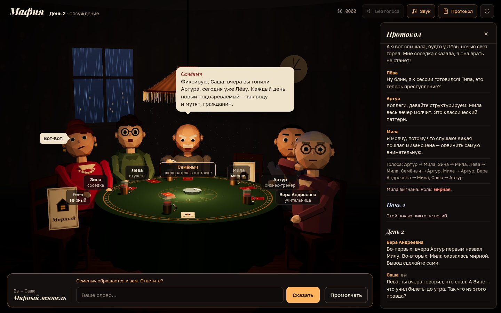

# 064 · Мафия

> Ночная коммунальная кухня, абажур над круглым столом и семеро соседей-нейросетей: у каждого характер, скрытая роль и своя ложь.

## Как запустить
Двойной клик по `index.html`. Нужен интернет: 3D-сцена грузит three.js с CDN, реплики пишет DeepSeek через OpenRouter (ключ свой — BYOK: вход через OpenRouter или ввод в окне при старте).

- Нет ключа или сети до нейросети — игра идёт в демо-режиме на заготовленных репликах, вверху метка «демо-режим — нейросеть не подключена». Если связь пропала посреди партии, после двух неудачных запросов подряд игра сама переходит на заготовки.
- Нет связи с CDN — вместо 3D включается упрощённая 2D-сцена, партия играется так же.

## Что делать
- На старте впишите имя и выберите роль: мирный житель, комиссар или мафия (тогда ваш напарник — нейросеть).
- Днём пишите в поле внизу. Клик по игроку или его табличке — обратиться к нему по имени; тот, к кому обратились, ответит. Вставить слово можно в любой момент, «Промолчать» — пропустить ход.
- «К голосованию» — перейти к голосу; голос — клик по табличке или кнопке с именем, можно воздержаться.
- Ночью: мафия выбирает жертву и может шепнуть напарнику, комиссар проверяет одного игрока.
- Пробел или клик по сцене — дочитать реплику сразу. «Протокол» — все реплики партии. После финала — «Запись ночи»: переговоры мафии, выбор доктора и комиссара и что каждый думал, пока говорил.
- «Голоса» — озвучка реплик системным русским голосом (если он есть в браузере), «Звук» — дождь, часы и стук по столу.

## Что внутри
- **Роли держит код.** Раздача, живые и выбывшие, проверки комиссара, спасения доктора, подсчёт голосов и условие победы — в `game.js`. Каждая нейросеть получает в system-промпте только свою тайну (напарника по мафии, свои проверки или спасения) и открытую запись партии.
- **Память на обвинения.** Кроме записи всех реплик, голосов и смертей, модель видит сжатую сводку «кто с кем спорил и за кого голосовал» — так ей проще поймать того, кто обвинял одного, а голосовал против другого. Старые дни сжимаются, смерти и голоса остаются.
- **Реплика — один потоковый ответ** с метками МЫСЛЬ / ЦЕЛЬ / ЖЕСТ / ЭМОЦИЯ / РЕПЛИКА. Мысль уходит в «Запись ночи», цель поворачивает головы и вызывает ответ обвинённого, жест и эмоция двигают 3D-персонажа, текст печатается в облачке по мере прихода токенов. Пока один говорит, следующий уже пишет ответ с учётом его слов.
- **Решения, меняющие игру, — через `AI.json`** со строгой схемой: голос днём, выбор жертвы мафией, выбор доктора и комиссара. Имя из ответа сверяется со списком кандидатов; мафия физически не может проголосовать против напарника; сломанный ответ заменяется разумным ходом по заготовке.
- **Ночной сговор.** Первый мафиози предлагает жертву шёпотом, второй отвечает и принимает решение. Если вы мафия — напарник предлагает, решаете вы. Выбывший игрок становится призраком: видит роли и слышит шёпот.
- **Сцена на three.js**: лоу-поли жильцы из примитивов с руками на двухзвенной IK, моргающие глаза и брови под эмоции, указующий жест на обвиняемого, красные нити голосов, процедурные текстуры клеёнки, обоев и карт ролей, шёлковый абажур со складками на шейдере, окно с дождём, дым и пыль в луче. Облачко реплики обходит абажур, разрешение подстраивается под скорость кадра.

## Почему это про Opus 5.5
Семь одновременных «умов» с разными характерами и тайнами, у которых ложь должна быть последовательной, а память — общей только в той части, что слышали все. Opus 5.5 развёл правду и видимость по коду и промптам так, чтобы нейросеть не могла подглядеть чужую роль, а игра не ломалась от её ошибок.

## Ограничения
- Качество спора зависит от DeepSeek: модель иногда повторяется, обвиняет слишком прямолинейно или приписывает кому-то слова, которых не было (промпт это запрещает, но не всегда успешно); сломанный ответ заменяется заготовкой.
- В демо-режиме реплики из набора заготовок с простой логикой подозрений — играть можно, но «ловить на противоречиях» там некому.
- Голоса — системный синтез речи браузера: один-два русских голоса на всех, характеры различаются высотой и темпом. Если русского голоса нет, реплики идут только текстом.
- Имя игрока склоняется эвристикой — для редких имён падежи могут выйти неточными.
- Проверочная живая партия (два дня, 35 запросов к DeepSeek) стоила $0,012; счётчик расходов виден в шапке.
- Персонажи — низкополигональные куклы из примитивов: мимика ограничена бровями, веками и ртом.
