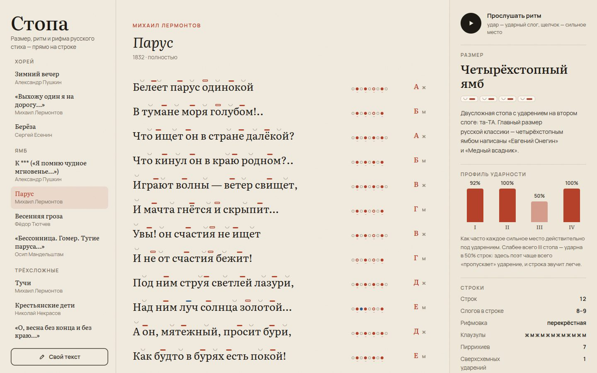

# 065 · Стопа

> Стиховед в браузере: ямб, хорей, дактиль, амфибрахий, анапест, дольник и тоника — размечены прямо над гласными.

## Как запустить
Двойной клик по `index.html`. Интернет нужен только для шрифтов.

## Что делать
- Выберите стихотворение слева — двенадцать текстов от Пушкина до Маяковского (всё — общественное достояние, с ударениями).
- Над каждой гласной — отметка: красная планка — ударение на сильном месте, пустая рамка — пиррихий (сильное место без ударения), синяя — сверхсхемное ударение, дужка — безударный слог.
- **Кликните по гласной**, чтобы перенести ударение, — размер, профиль и рифмовка пересчитаются.
- **«Прослушать ритм»:** удар барабана — ударный слог, щелчок — сильное место размера.
- **«Свой текст»:** вставьте стихи; ударения угадываются по найденному размеру (пунктирные — проверьте кликом).

## Что внутри
- Разбор на слоги по гласным, ударения из разметки (`бу'ря`) или по правилам для своего текста.
- Для каждого из пяти классических размеров считается согласие ударений с сильными местами; сверхсхемные ударения на односложных словах штрафуются мягко, на многосложных — сильно. Если классика не подходит, проверяется дольник (между ударениями 1–2 слога), иначе — тонический стих.
- Число стоп, клаузулы (мужская, женская, дактилическая), рифмы по ударной гласной и последующим согласным, тип рифмовки по строфам.
- **Профиль ударности** — доля строк, где каждое сильное место действительно ударно. Анализатор сам находит известные свойства русского стиха: у четырёхстопного ямба слабее всего третья стопа, у шестистопного — пятая.

## Почему это про Opus 5.5
Задача на стыке языка и алгоритма: нужно знать тексты дословно, верно расставить ударения и превратить стиховедение в работающий, проверяемый код.

## Ограничения
- В своём тексте ударения угадываются эвристикой — словаря нет, поэтому пунктирные отметки стоит проверить.
- Рифмы определяются по написанию с поправками на произношение, а не по фонетической транскрипции.
