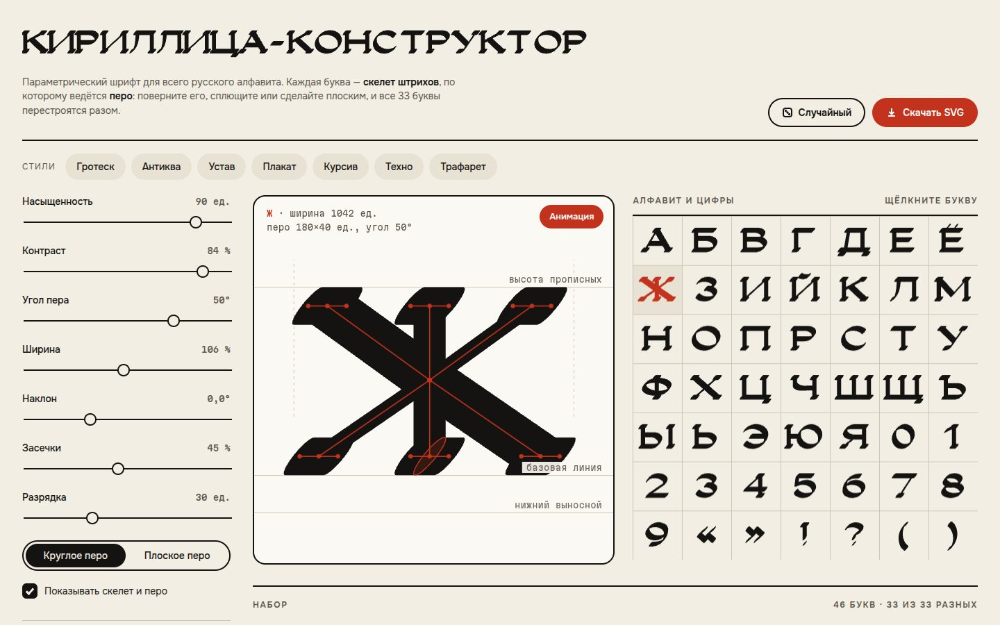

# 066 · Кириллица-конструктор

> Параметрический шрифт для всего русского алфавита: каждая буква — скелет штрихов, по которому ведётся перо. Меняете перо — перестраиваются все 33 буквы.

## Как запустить
Двойной клик по `index.html`. Интернет нужен только для шрифтов интерфейса (Onest, Martian Mono). Сами буквы строятся кодом.

## Что делать
- **Ползунки**: насыщенность, контраст, угол пера, ширина, наклон, засечки, разрядка. Переключатель круглого и плоского пера.
- **Стили**: гротеск, антиква, устав, плакат, курсив, техно, трафарет. Переход между ними анимирован.
- **Алфавит**: щёлкните букву — она появится крупно, со скелетом, метриками и формой пера.
- **Набор**: впишите свой текст (по умолчанию — панграмма «Съешь же ещё этих мягких французских булок, да выпей чаю»).
- **Скачать SVG** — набранный текст векторными контурами. **Случайный** — неожиданные сочетания параметров.
- Пока вы ничего не трогаете, шрифт медленно «дышит» и перебирает буквы; кнопка «Анимация» включает и выключает это.

## Что внутри
- Скелеты 33 прописных букв, цифр и знаков заданы центральными линиями: прямыми, дугами эллипсов и кривыми Безье.
- Контур буквы — сумма Минковского скелета и пера: для каждой точки берётся опорная точка эллипса или прямоугольника в направлении нормали, на концах и в углах ставится отпечаток пера. Объединение — правило заливки nonzero.
- Контраст не рисуется вручную: штрих вдоль кромки пера выходит тонким, поперёк — толстым, как у ширококонечного пера.
- Скелет сжимается на величину пера, поэтому при любой насыщенности буквы стоят точно на базовой линии и не вылезают за высоту прописных. Засечки появляются автоматически на вертикальных окончаниях у базовой линии и линии прописных.
- Кэш построенных букв, отрисовка на Canvas с учётом плотности пикселей, экспорт SVG тем же построением.

## Почему это про Opus 5.5
Задача на стыке типографики и вычислительной геометрии: нужно понимать, как устроены кириллические буквы и перо каллиграфа, и перевести это в корректную геометрию без ручной подгонки.

## Ограничения
Только прописные: строчные при наборе превращаются в прописные. Кернинга нет, межбуквенный интервал задаётся разрядкой. На очень толстом пере и крутых изгибах контуры упрощены.
