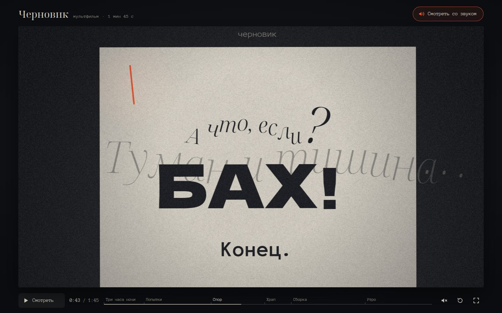

# 067 · Черновик

> Мультфильм на 1 мин 45 с в технике кинетической типографики: в три часа ночи мигающий курсор помогает писателю найти первую фразу.

## Как запустить
Двойной клик по `index.html`. Интернет нужен только для шрифтов Google (Noto Serif Display, Dela Gothic One, Anonymous Pro). Без сети фильм идёт на системных шрифтах, сюжет тот же, а в углу кадра появляется короткая пометка.

## Что делать
- Фильм сразу идёт без звука. Кнопка «Смотреть со звуком» перезапускает его с начала уже со звуком.
- Пробел — пауза, ← → — на 5 секунд, F — во весь экран, M — звук.
- Шкала времени с метками шести сцен: клик или перетаскивание перематывают фильм. Под кадром есть кнопки сцен.

## Что внутри
- Кадр — функция от времени в долях такта (112 ударов в минуту). У каждого актёра трек из сегментов с easing и наложений (дрожь, смех, «сникание»), у камеры — ключи, склейки и толчки. Поэтому перемотка точная в обе стороны.
- Буквы играют: прыжок с упреждением, сжатием и захлёстом, баллистика с отскоком, полёт по кривой Безье, вихрь. У каждого голоса своя гарнитура. Точка — отдельный персонаж: влезает раньше времени и выносит приговоры «Банально.», «было.» и «Конец.».
- Удалённые буквы падают под страницу в кучу. Это карта высот с детерминированной укладкой. В финале фраза собирается из тех же литер, и каждая прилетает оттуда, где упала.
- Метрики глифов меряются реальным шрифтом. Если шрифты догрузились позже, фильм пересобирается и сохраняет текущее время.
- Звук синтезируется на Web Audio: пианино с войлочными молоточками, механические клавиши, тиканье курсора, звон литер, храп. Реплики берутся из того же сценария и планируются вперёд по часам AudioContext, а эти часы ведут и картинку.
- Canvas 2D: процедурная бумага, зерно, виньетка, свечение курсора в темноте, рассвет в последней сцене.

## Почему это про Opus 5.5
Сценарий, хореография сотен букв, операторская работа и партитура — одна программа: каждый кадр и каждая нота выводятся из одного числа. Финальную фразу собирают те самые буквы, которые весь фильм смеялись над писателем.

## Ограничения
- Реплик нет: вся драматургия держится на тексте в документе и на движении.
- Пианино — аддитивная модель с шумом молоточка, а не сэмплы.
- Раскладка кучи и строк опирается на метрики шрифта, поэтому на системных шрифтах кадры немного отличаются.
- На телефоне кадр 16:9 мелкий, лучше смотреть во весь экран.
