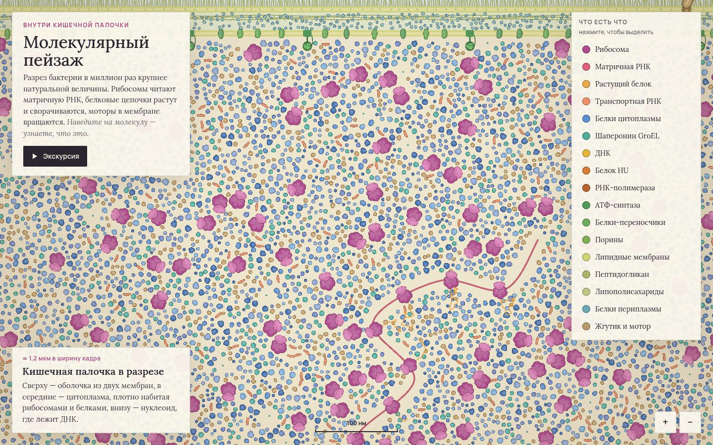

# 068 · Молекулярный пейзаж

> Разрез кишечной палочки в миллион раз крупнее натуральной величины, нарисованный в духе акварелей Дэвида Гудселла. Рибосомы ползут по матричной РНК, растущие белки сворачиваются и уплывают, вращаются АТФ-синтазы и жгутик.

## Как запустить
Двойной клик по `index.html`. Работает без интернета (без сети шрифты заменятся системными).

## Что делать
- **Колесо, щипок, кнопки «+» и «−»** — зум от всей клетки до отдельной рибосомы. Перетаскивание — сдвиг.
- **Наведение** (на телефоне — касание) — название молекулы, её размер и роль.
- **Легенда справа**: клик по пункту приглушает всё остальное и показывает, где в клетке этот вид молекул.
- **Экскурсия** — камера сама проходит по восьми остановкам: оболочка, АТФ-синтаза, жгутик, теснота цитоплазмы, полисома, растущая цепочка, РНК-полимераза.

## Что внутри
- Сцена генерируется процедурно (около 10 тысяч молекул): рибосомы, шаперонины, тРНК и белки размещаются без наложений через сетку-индекс; ДНК и мРНК — сплайны Катмулла — Рома.
- Спрайты «в духе Гудселла»: силуэт из нескольких долей, тёмный контур, плоская заливка, светлая середина, неровность пигмента. Рисуются один раз и затем только поворачиваются и масштабируются.
- Полисома: рибосомы движутся по мРНК от 5′- к 3′-концу, длина цепочки растёт с пройденным путём, готовый белок сворачивается в глобулу и уплывает, на старте садится новая рибосома.
- Масштабы близки к реальным: рибосома ≈ 21 нм, ДНК — 2 нм с шагом витка 3,4 нм, мембраны ≈ 7 нм, периплазма ≈ 20 нм.
- Дальний план — заранее отрисованная картинка всей клетки, ближний — живые молекулы; между ними плавный переход.

## Почему это про Opus 5.5
Точные знания по молекулярной биологии (сопряжённые транскрипция и трансляция у бактерий, строение оболочки, размеры) превращены в иллюстрацию, которую можно исследовать.

## Ограничения
- Формы молекул условные: это иллюстрация, а не атомные модели.
- Броуновское движение показано медленным «покачиванием», а трансляция идёт медленнее реальной (~20 аминокислот в секунду), чтобы на неё можно было смотреть.
- Срез двумерный, а плотность упаковки передана приблизительно.
