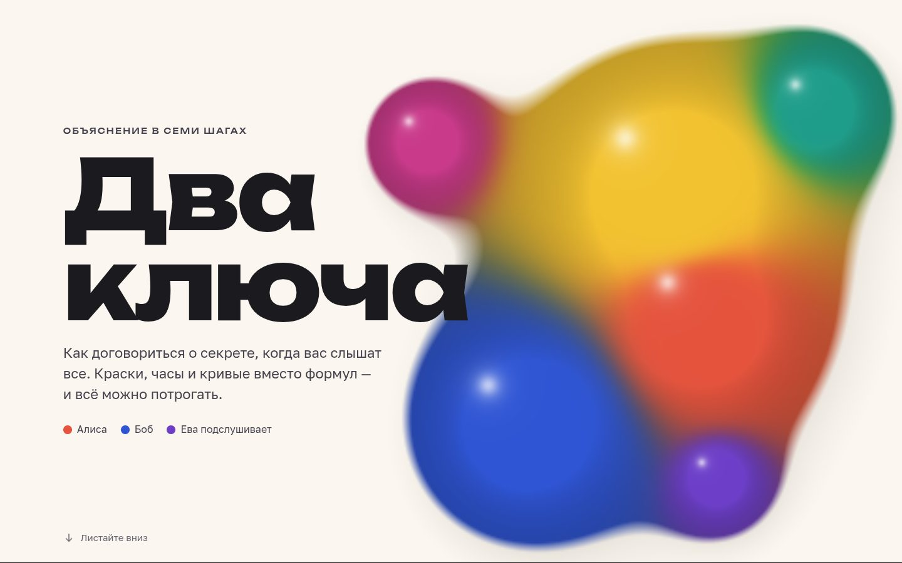

# 069 · Два ключа

> Как договориться о секрете, когда вас слышат все. Семь глав о криптографии с открытым ключом: краски, часы, RSA и эллиптические кривые — всё можно потрогать.

## Как запустить
Двойной клик по `index.html`. Интернет нужен только для шрифтов Unbounded, Golos Text и JetBrains Mono.

## Что делать
- Листайте главы; слева появится оглавление.
- «Смешать легко, разделить нельзя»: выберите тайные краски Алисы и Боба и пройдите обмен Диффи — Хеллмана по шагам. В конце Ева смешает перехваченное — и промахнётся.
- «Часы вместо красок»: двигайте показатель степени по циферблату mod 23, потом попробуйте угадать x по положению стрелки.
- «Краски, ставшие числами»: настоящий обмен на BigInt с простым p = 2⁶¹ − 1.
- «Замок, который защёлкнет каждый»: выберите простые p и q, зашифруйте сообщение по буквам и расшифруйте тайным ключом. Кнопка «Создать ключ» генерирует настоящий 2048-битный ключ RSA прямо в браузере.
- «Сложение на кривой»: тяните точки P и Q по кривой y² = x³ − x + 1, а потом кликайте по россыпи точек той же кривой по модулю 97.

## Что внутри
- Смешивание красок — среднее геометрическое отражений в линейном RGB: жёлтое с синим даёт зелёное, как у настоящих красок.
- Модульная арифметика и Диффи — Хеллман на BigInt, быстрое возведение в степень.
- RSA: расширенный алгоритм Евклида для d; генерация ключа в Web Worker — случайные кандидаты, пробное деление и тест Миллера — Рабина (24 раунда).
- Эллиптическая кривая над ℝ и над 𝔽₉₇: сложение и удвоение точек, «заворачивающаяся» прямая, прыжки kP.
- Метаболы на первом экране смешиваются как краски и блестят «мокрым» бликом.

## Почему это про Opus 5.5
Ясное письмо — одна из заявленных сильных сторон модели. Здесь оно соединено с точной математикой и интерактивными схемами, которые проверяют сами себя.

## Ограничения
- Числа в главах учебные; побуквенный RSA ломается частотным анализом — это прямо показано в тексте.
- Генерация 2048-битного ключа занимает от долей секунды до нескольких секунд: всё зависит от везения со случайными кандидатами.
