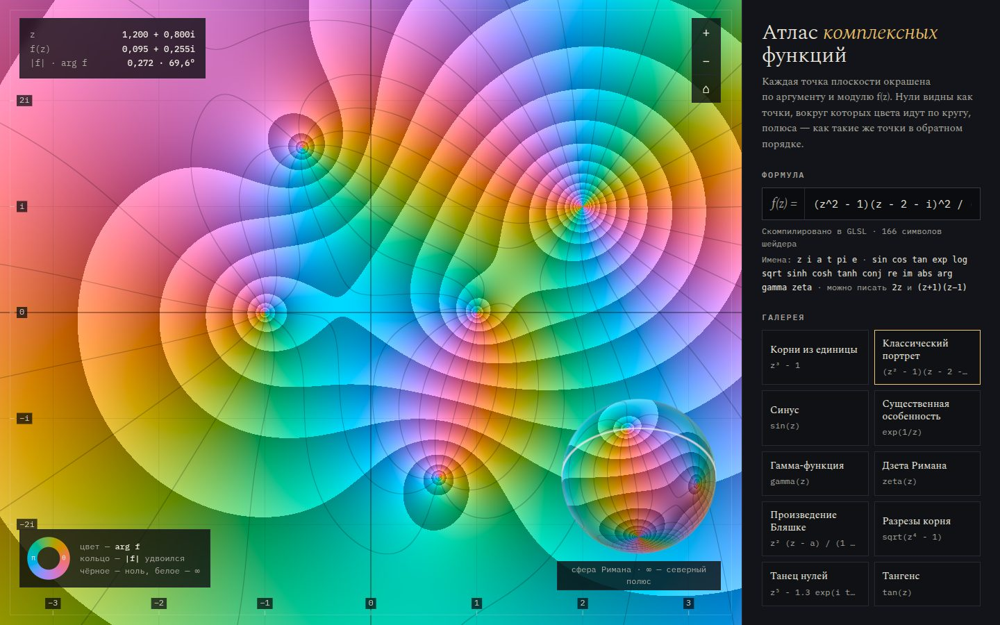

# 070 · Атлас комплексных функций

> Окраска области: введите f(z) — формула компилируется в шейдер и за доли секунды превращается в фазовый портрет с нулями и полюсами.

## Как запустить
Двойной клик по `index.html`. Нужен WebGL2. Без интернета работает, шрифты заменятся системными.

## Что делать
- Впишите формулу: `z^3 - 1`, `sin(z)/z`, `(z+1)(z-2i)`, `gamma(z)`, `zeta(z)`. Неявное умножение работает: `2z`, `(z+1)(z−1)`.
- Тяните плоскость, крутите колесо (или щипок на телефоне) — масштаб вокруг курсора.
- Галерея из 10 пресетов: корни из единицы, классический портрет, синус, существенная особенность, гамма, дзета Римана, произведение Бляшке, разрезы корня, «танец нулей», тангенс.
- Если в формуле есть `a`, на плоскости появляется маркер — перетаскивайте его. Если есть `t`, это время: нули начинают двигаться.
- Три раскраски: «Фаза и кольца», «Классика», «Рельеф». Справа внизу — сфера Римана, её можно вращать.
- Наведите курсор — сверху слева появятся z, f(z), модуль и аргумент. Формула сохраняется в адресе страницы (`#f=…`), ссылкой можно поделиться.

## Что внутри
- Свой парсер Пратта: токены → дерево → код GLSL с комплексной арифметикой (`cmul`, `cdiv`, `cpow`, целые степени — быстрым возведением).
- Гамма-функция — формула Ланцоша с отражением. Дзета — ряд Дирихле для эта-функции с ускорением сходимости Борвейна (30 членов) и функциональное уравнение для Re z < ½.
- Палитра фазы — окружность в OKLCH: все фазы одной светлоты, без «ярких» и «тёмных» секторов, как в HSV.
- Кольца модуля и изохромы сглаживаются через `fwidth` и гаснут там, где становятся гуще пикселя.
- Та же функция считается на JS для подсказки под курсором.

## Почему это про Opus 5.5
Маленький компилятор выражений и численные методы (Ланцош, Борвейн) внутри шейдера: строгая математика, превращённая в интерактивную картинку.

## Ограничения
- Шейдер считает в одинарной точности: при сильном зуме видны ступеньки, дзета надёжна примерно при |Im z| < 40.
- `sqrt`, `log`, `pow` дают главную ветвь — поэтому видны разрезы.
