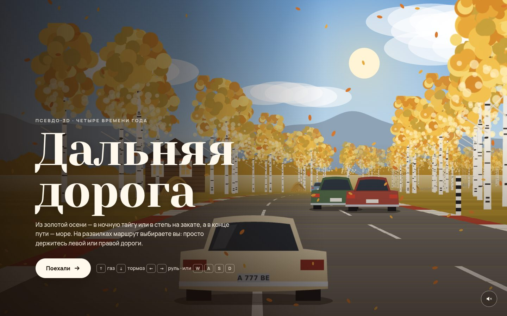

# 071 · Дальняя дорога

> Псевдо-3D гонка в духе OutRun по России четырёх сезонов: на развилках выбираете маршрут, и время года меняется прямо на ходу.

## Как запустить
Двойной клик по `index.html`. Работает без интернета (шрифты заменятся системными).

## Что делать
- «Поехали» или пробел. **↑/W** — газ, **↓/S** — тормоз, **←/→** или **A/D** — руль. На телефоне — кнопки внизу, газ автоматический.
- Перед развилкой появляется щит: держитесь левой или правой дороги — туда и поедете.
- Маршрут: золотая осень → ночная тайга или степь на закате → … → море на рассвете. После финиша — сводка поездки.
- Обгоняйте машины и не вылетайте за обочину: берёзы, ели и избы останавливают резко.

## Что внутри
- Классический сегментный псевдо-3D: дорога — лента сегментов с кривизной и высотой, проекция каждого сегмента, отсечение холмами, туман.
- Настоящие развилки: сегмент хранит абсолютное смещение центра дороги, ветки расходятся, выбранная продолжается, а другая уходит в сторону. Следующий этап строится в момент выбора.
- Все спрайты — берёзы, ели в снегу, подсолнухи, кипарисы, цветущий миндаль, избы с наличниками, маяк, машины — нарисованы кодом на Canvas.
- Биомы плавно смешивают палитры земли, дороги, неба и дальних слоёв. Ночью в тайге светят фары, идёт снег; осенью летят листья.
- Звук: мотор из двух генераторов с фильтром и генеративная музыка — у каждого биома свой лад.

## Почему это про Opus 5.5
Игровой движок с нуля, процедурный арт и дизайн уровней в одном файле — тот класс задач, где у Opus 5.5 в тестах получались игры и 3D-сцены.

## Ограничения
- Физика аркадная: занос, коробка передач и повреждения не моделируются.
- Встречного движения нет, машины едут только попутно.
