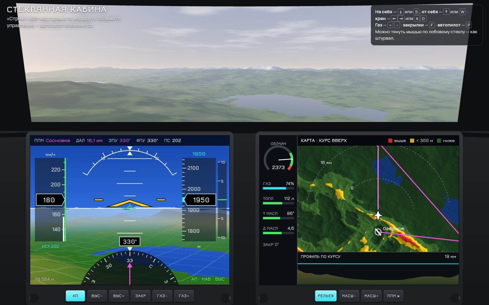

# 072 · Стеклянная кабина

> Лёгкий самолёт «Стриж» над процедурными горами. Сверху — вид через лобовое стекло, ниже — два дисплея: пилотажный с синтетическим рельефом и карта, которая краснеет там, где земля выше самолёта.

## Как запустить
Двойной клик по `index.html`. Нужен WebGL2. Звук двигателя включается при первом нажатии. Без интернета работает всё, вместо шрифтов Jura и Manrope подставятся системные.

## Что делать
- Самолёт летит на автопилоте по маршруту Озёрное → Сосновка → Кедровый (названия вымышленные).
- Возьмите управление — автопилот отключится с сигналом:
  - на себя (нос вверх) — ↓ или S, от себя — ↑ или W;
  - крен — ← → или A D;
  - газ — + −;
  - закрылки — F;
  - снова включить автопилот — P.
- Можно тянуть мышью или пальцем по лобовому стеклу — как штурвалом.
- Экранные кнопки:
  - АП, ВЫС±, ЗАКР, ГАЗ± — под пилотажным дисплеем;
  - РЕЛЬЕФ (относительная раскраска), МАСШ±, ППМ — под картой.
- Потяните на себя слишком сильно — сработает «СВАЛИВАНИЕ». Влетите в склон — полёт перезапустится.

## Что внутри
- **Рельеф** — периодический шум с хребтами: мир повторяется без швов. Аэродромы ставятся в пологие низины, площадки под полосы выравниваются.
- **WebGL2 рисует одну сцену дважды:**
  - вид из кабины — трава, лес, скалы, снег, озёра с отражением неба, воздушная перспектива, перистые облака;
  - синтетический рельеф PFD — окраска по высоте и сетка через километр. Проекция смещена так, чтобы горизонт совпал со шкалой тангажа.
- **Модель полёта** — материальная точка с углами: подъёмная сила по углу атаки со срывом, индуктивное сопротивление, тяга винта падает со скоростью, координированный разворот.
- **Автопилот:** крен пропорционален ошибке курса на ППМ (до 25°), тангаж регулирует вертикальную скорость к заданной высоте.
- **Карта** в режиме «курс вверх» с относительным рельефом:
  - красным — выше самолёта;
  - жёлтым — в пределах 300 м ниже.
  Ниже карты — профиль местности по курсу с линией траектории.
- Приборы в метрах и км/ч, обозначения по-русски: ЗПУ, ФПУ, ПС, ППМ, РВ.

## Почему это про Opus 5.5
Сложный интерфейс реального времени: авионика, 3D-рендер и физика полёта в одном файле без библиотек. Модель полёта и автопилот проверены в Node на десяти минутах полёта: высота держится, маршрут проходится, запас над рельефом не меньше 460 м.

## Ограничения
- Это не тренажёр: упрощённая модель без полноценных шести степеней свободы, без ветра и без посадки на полосу.
- Самолёт «Стриж», аэродромы и показания топлива и масла условные.
- Скорость на приборе приведена из истинной по плотности воздуха — упрощённо.
