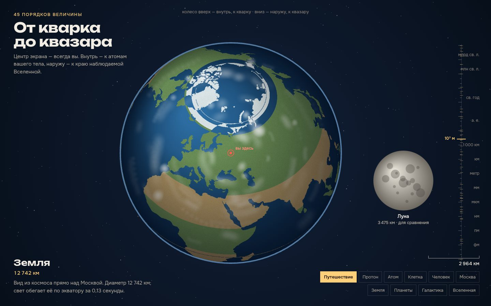

# 073 · От кварка до квазара

> Непрерывный зум через 45 порядков величины. Центр экрана — всегда вы: внутрь — к кварку в протоне вашего атома, наружу — к краю наблюдаемой Вселенной.

## Как запустить
Двойной клик по `index.html`. С интернетом Земля рисуется с настоящими материками (world-atlas с jsdelivr), без сети — глобусом с сеткой. Всё остальное работает офлайн.

## Что делать
- **Колесо**, перетаскивание вверх-вниз или щипок — масштаб. **Шкала справа** — прыжок к любому порядку.
- **Кнопки внизу** — к протону, атому, клетке, человеку, Москве, Земле, планетам, Галактике, Вселенной.
- **«Путешествие»** (или пробел) — автоматический полёт: сначала вглубь до кварка, потом наружу до края Вселенной.
- Карточка слева внизу рассказывает об объекте в фокусе.

## Что внутри
- **Вложенная цепочка:** кварк ⊂ протон ⊂ ядро углерода ⊂ атом ⊂ ДНК ⊂ ядро клетки ⊂ клетка ⊂ человек ⊂ Москва (кольца МКАД, ТТК, Садовое, Бульварное) ⊂ Земля (вид прямо над Москвой).
- **Дальше — честные положения:** Луна на своей орбите, Солнце в 1 а. е. сбоку, «Вояджер-1» примерно в 170 а. е., центр Галактики в 26 000 св. лет, Андромеда и Магеллановы облака по галактическим координатам.
- **Объекты для сравнения** (вирус, эритроцит, тихоходка, кит, Останкинская башня, Эверест, Байкал, Юпитер, Бетельгейзе, Омега Центавра) стоят сбоку и подписаны «для сравнения».
- **Процедурная графика:** галактика — 26 000 звёзд с пылевыми рукавами, космическая паутина — граф ближайших соседей, край Вселенной — пятна реликтового излучения. Спрайты заранее прогреваются в простое.
- **Земля:** суша растеризуется в равнопромежуточную карту, глобус строится обратной ортографической проекцией попиксельно.

## Почему это про Opus 5.5
Много точных фактов из разных наук (ядерная физика, биология, география, астрономия) в одном визуальном ряду — там, где ошибку сразу видно.

## Ограничения
- Размер кварка не измерен: показана верхняя граница.
- Положения ближайших звёзд, Местной группы и Ланиакеи — проекции на плоскость Галактики, приблизительные. Направление на квазар 3C 273 условное.
- Цвета Земли — условная раскраска по широте, а не спутниковый снимок.
