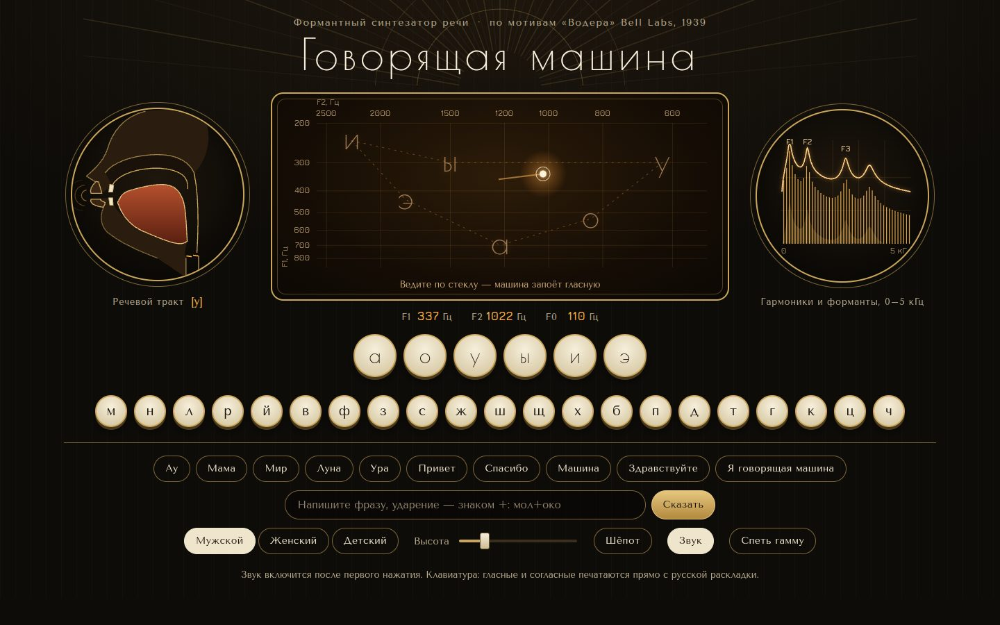

# 074 · Говорящая машина

> Формантный синтезатор речи по мотивам «Водера» Bell Labs (1939): ведёте пером по треугольнику гласных — машина поёт «а», «о», «у», «и», «э», «ы», а в разрезе видно, как движется язык.

## Как запустить
Двойной клик по `index.html`. Интернет не нужен (без него только шрифты станут системными). Звук включается после первого нажатия — так требуют браузеры.

## Что делать
- **Ведите по стеклу** с треугольником гласных — машина тянет гласную и плавно перетекает между ними. Оси настоящие: F1 и F2 в герцах, логарифмическая шкала.
- **Клавиши**: гласные звучат, пока держите; согласные произносят слог с ближайшей гласной. Работает и физическая клавиатура — русская раскладка или латинская по позициям ЙЦУКЕН.
- **Готовые слова** и **своя фраза**. Ударение ставится знаком `+` перед гласной: `мол+око`. Если ударение известно, безударные редуцируются: «молоко» звучит как [малако].
- **Голос** мужской, женский или детский, ползунок высоты, **шёпот** (вместо голосовых складок — шум), **«Спеть гамму»**: до-ре-ми-фа-соль-ля-си-до. Кнопка **«Звук»** выключает звук целиком.

## Что внутри
- **Источник — фильтр.** Голос — периодическая волна с гармониками, спадающими как k^−1,35; шёпот и придыхание — шум. Фильтр — четыре параллельных формантных резонатора (знаки чередуются, чтобы между формантами не было провалов), носовой резонанс ~270 Гц с антирезонансом для [м] и [н], отдельная шумовая ветка для фрикативных.
- **Фонемы — цели параметров.** Гласные заданы усреднёнными формантами для мужского голоса (например, [а] — 700 и 1220 Гц, [и] — 240 и 2250 Гц). Смычные — это смычка, взрыв и придыхание; [р] — три удара кончика языка.
- **Фонемизатор русского**: йотированные «е, ё, ю, я» в начале слова и после гласных, оглушение звонких на конце слова и перед глухими («хлеб» → [хлэп]), аканье и иканье при известном ударении.
- **Интонация**: плавное понижение тона к концу фразы, подъём на ударных, падение на последнем слоге.
- **Схема тракта** в SVG: положение спинки языка, раствор челюсти и округление губ интерполируются по формантам; для согласных — смычка губ, подъём кончика или спинки языка, опускание нёбной занавески.
- **Спектр** — не БПФ, а расчёт из модели: гармоники частоты основного тона под огибающей формант, шумовая полоса для фрикативных.

## Почему это про Opus 5.5
Здесь сходятся фонетика русского языка, акустика речевого тракта и цифровая обработка звука. Ошибка в любой из трёх частей сразу слышна, поэтому связка должна быть точной.

## Ограничения
- Это роботизированная речь в духе 1939 года, а не современный синтез: разборчивы гласные и простые слова, длинные фразы звучат механически.
- Мягкость согласных не моделируется. Ударение без знака `+` ставится только в односложных словах.
- Форманты — усреднённые значения; у реальных людей они заметно различаются.
