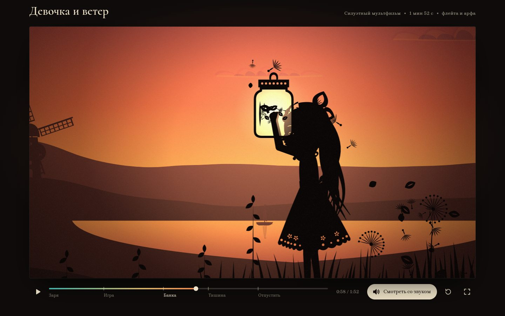

# 075 · Девочка и ветер

> Силуэтный мультфильм на 1 мин 52 с: девочка поймала ветер в банку, мир замер — и она понимает, что ветер надо отпустить.

## Как запустить
Двойной клик по `index.html`. Интернет нужен только для шрифтов Google (Cormorant, Brygada 1918): без него титры набираются системной антиквой, а фильм и звук работают так же.

## Что делать
- Фильм начинается сам, без звука. Кнопка «Смотреть со звуком» запускает его сначала — с музыкой и шумами (браузер разрешает звук только после нажатия).
- Пробел или щелчок по кадру — пауза, ← → — ±5 с, F — во весь экран, M — звук.
- Шкала времени: перемотка перетаскиванием, пять сцен подписаны («Заря», «Игра», «Банка», «Тишина», «Отпустить»), при наведении — превью кадра.

## Что внутри
- **Кадр — функция времени `t`.** Хронометраж из 19 планов (два из них — вставки: мельница и одуванчик), камера с многоплановым параллаксом, наплывы, вспышка, диафрагма в финале. Поэтому перемотка в любую точку показывает ровно тот же кадр.
- **Кукла на шарнирах, как в перекладке:** таз, корпус, шея, голова в профиль, по две руки и ноги; сто поз и 131 ключ на дорожке с easing. Лица нет — играют поза, наклон головы и прорези глаза, брови и рта. Есть сжатие перед прыжком, упреждение, захлёст, циклы шага и бега.
- **Ветер как поле.** Утром фронт приходит слева, трава откликается затухающей пружиной, проинтегрированной один раз на старте. В момент поимки поле обрывается: трава распрямляется с перехлёстом и замирает, мельница выбегает до остановки. При освобождении от банки бежит круговая волна.
- **Волосы, юбка и ленты** — цепочки, которые тянутся по потоку воздуха: ветер минус скорость тела плюс захлёст. Захлёст считается свёрткой движения с откликом осциллятора, поэтому он тоже зависит только от `t`.
- **Частицы без состояния:** семена одуванчика, листья и лепестки за духом ветра заданы формулой от номера частицы и времени. Пойманные в момент поимки семена висят в воздухе, пока банку не откроют.
- **Музыка на Web Audio:** арфа по Карплусу — Стронгу, флейта с вибрато и шумом дыхания, размер 6/8 — сцены смонтированы по тактам. Около 500 событий партитуры, шаги по фазе походки, звон стекла, хлопок крышки, шум ветра следует его силе в кадре. Ведущие часы — аудио, кадр подтягивается к ним плавно.

## Почему это про Opus 5.5
Сюжет, кинематика куклы, физика ветра, свет, монтаж и партитура написаны одним кодом и сведены по одной временной шкале — это режиссура, а не набор эффектов.

## Ограничения
- Инструменты синтезированы: у арфы и флейты узнаваемый характер, но до живых инструментов им далеко.
- После перемотки со звуком фраза флейты, начатая раньше точки перемотки, не доигрывается: музыка вступает со следующего события.
- Силуэты рисуются кривыми Canvas 2D в каждом кадре. На слабом компьютере плеер снижает разрешение, чтобы не терять плавность.
- Кукла только в профиль, повороты к зрителю не предусмотрены.
