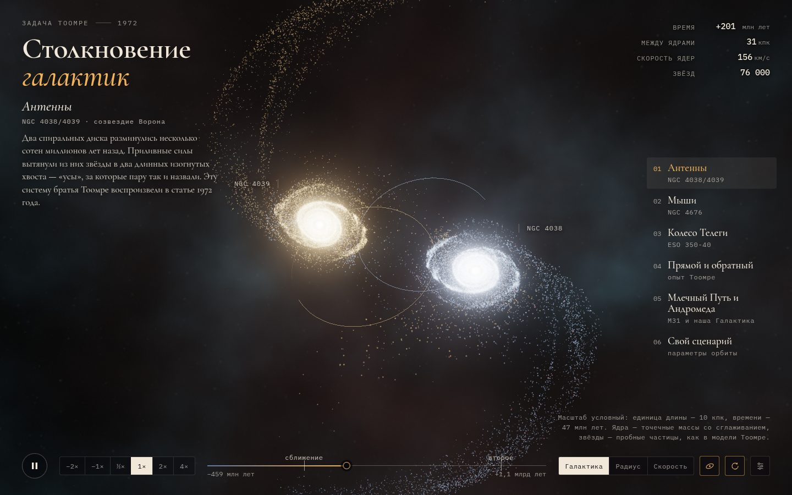

# 076 · Столкновение галактик

> Задача Тоомре в реальном времени: два галактических ядра и 76 000 звёзд-частиц рисуют приливные хвосты, кольца и мосты — и всё это можно перемотать назад.

## Как запустить
Двойной клик по `index.html`. Интернет нужен только для шрифтов; без него работают системные.

## Что делать
- Тянуть мышью — вращать камеру, колесо или щипок — приблизить, двойной клик — вернуть вид.
- Справа — пять сценариев: «Антенны» (NGC 4038/4039), «Мыши» (NGC 4676), «Колесо Телеги» (ESO 350-40), «Прямой и обратный», «Млечный Путь и Андромеда» (с отмеченным Солнцем). Клавиши 1–5.
- Снизу — шкала времени: тяни, чтобы перемотать; кнопки −2× и −1× пускают время назад.
- Окраска звёзд: по родной галактике, по начальному радиусу в диске (видно, что хвосты — из окраин) или по лучевой скорости (к нам — синий, от нас — красный).
- «Свой сценарий»: масса, перицентр, эксцентриситет, наклоны дисков, трение о гало.
- Пробел — пауза, ← → — шаг.

## Что внутри
- Модель братьев Тоомре (1972): ядра — точечные массы со сглаживанием, звёзды — пробные частицы, которые чувствуют оба ядра, но сами не притягивают.
- Орбита ядер заранее интегрируется методом Рунге — Кутты 4-го порядка (16 подшагов на шаг) — с упрощённым динамическим трением для сценария со слиянием.
- Звёзды считаются симметричной схемой «дрейф — толчок — дрейф» в двойной точности. Она обратима во времени: шаг назад точно отменяет шаг вперёд, поэтому перемотка — это настоящая физика, а не запись.
- Диски — экспоненциальные, с двумя логарифмическими спиральными рукавами, балджем и розовыми областями звездообразования.
- Рендер без библиотек: WebGL2, накопление в HDR-буфере, процедурное звёздное небо и пыль, шестиуровневый блум, тональная компрессия ACES, зерно против бандинга. Разрешение подстраивается под скорость кадра.

## Почему это про Opus 5.5
Здесь сходятся междисциплинарные рассуждения (небесная механика, выбор обратимого интегратора, масштабирование в килопарсеки и миллионы лет) и кинематографичный 3D-рендер, написанный с нуля.

## Ограничения
- Это модель пробных частиц: диски не притягивают сами себя, тёмного гало нет. Приливные хвосты она воспроизводит хорошо, а слияние — только через упрощённое трение.
- Параметры «Антенн», «Мышей» и «Колеса Телеги» подобраны по мотивам классических работ, а не подогнаны под наблюдения.
- Масштаб условный: 1 единица длины — 10 кпк, времени — 47 млн лет, массы — 10¹¹ M☉.
- Сценарий «Млечный Путь и Андромеда» — иллюстрация: по расчётам 2025 года слияние в ближайшие 10 млрд лет вероятно лишь примерно наполовину.
