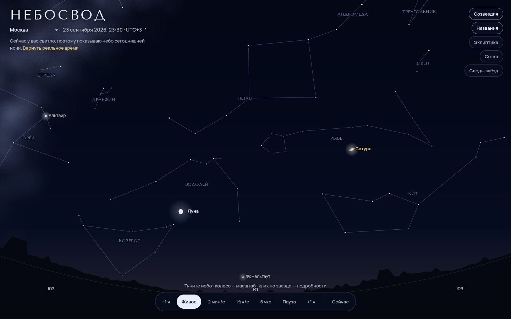

# 077 · Небосвод

> Небо над вами прямо сейчас: яркие звёзды с настоящими координатами и цветами, созвездия, планеты по элементам орбит, Луна с фазой и сумерки по высоте Солнца.

## Как запустить
Двойной клик по `index.html`. Интернет не нужен (шрифты заменятся системными). Если в выбранном городе сейчас светло, страница покажет небо ближайшей ночи и скажет об этом; кнопка вернёт реальное время.

## Что делать
- Тяните небо, колесо или щипок — масштаб (поле зрения от 20° до 170°).
- Клик по звезде, планете, Луне или Солнцу — карточка: высота, азимут, координаты, расстояние, фаза.
- Внизу — время: живое, 2 мин/с, ½ ч/с, 6 ч/с, пауза, ±1 час, «Сейчас».
- Справа слои: созвездия, названия, эклиптика, сетка, «Следы звёзд» (длинная выдержка вокруг Полярной).
- Место: восемь городов от Калининграда до Владивостока.

## Что внутри
- Каталог ~175 ярких звёзд (J2000): прямое восхождение, склонение, блеск V и показатель цвета B−V. Цвет — по формуле Баллестероса через температуру.
- 25 фигур созвездий, Млечный Путь по галактической плоскости (переход из галактических координат в экваториальные).
- Планеты — кеплеровы элементы JPL (Standish, 1800–2050) и решение уравнения Кеплера. Луна — упрощённая теория с главными возмущениями (точность ~0,3°). Звёздное время, переход к горизонтальным координатам, рефракция у горизонта (формула Беннета).
- Небо окрашено по высоте Солнца: день, гражданские, навигационные и астрономические сумерки, ночь. Предельная звёздная величина меняется вместе с ним.
- Стереографическая проекция, как в планетариях, со своим обратным преобразованием для клика.

## Почему это про Opus 5.5
Точные знания и алгоритмы (эфемериды, сферическая тригонометрия) плюс аккуратная визуализация — работа, где ошибки сразу видны на небе.

## Ограничения
- Прецессия от J2000 не учитывается (сдвиг около 0,35° к 2026 году), собственное движение звёзд тоже.
- В каталоге только яркие звёзды, примерно до 4,5ᵐ, поэтому фон реального неба за городом богаче.
- Точность Луны около 0,3°, планет — порядка угловых минут.
