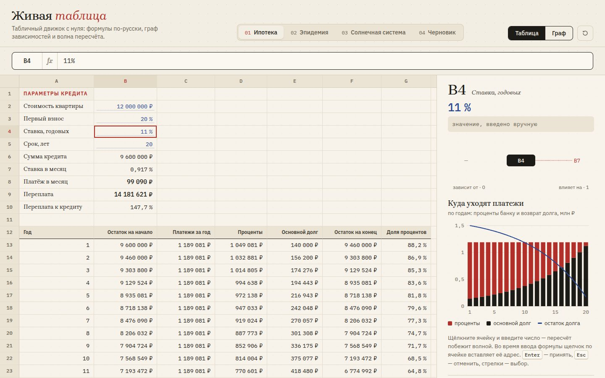

# 078 · Живая таблица

> Табличный движок, написанный с нуля: формулы на русском, граф зависимостей и волна пересчёта, которую видно глазами.

## Как запустить
Двойной клик по `index.html`. Интернет нужен только для шрифтов.

## Что делать
- Щёлкнуть ячейку и ввести число, процент (`12%`) или формулу (`=ПЛТ(B7;B5*12;-B6)`), потом `Enter`. От изменённой ячейки по всем зависимым побежит волна: вспышки, дуги от причин к следствиям, числа, которые «докручиваются» до нового значения.
- Во время ввода формулы щелчок по ячейке вставляет её адрес, как в настоящих табличных программах. Ссылки подсвечиваются своим цветом и в строке формул, и на листе.
- Автодополнение функций: начните вводить `=СУ` — появятся подсказки с описанием. `Tab` или `Enter` вставляет функцию.
- «Граф» превращает лист в сеть зависимостей: клетки разлетаются в узлы, выстроенные по глубине пересчёта. Колесо — масштаб, перетаскивание — сдвиг, щелчок — выбрать ячейку.
- Вкладки с моделями: «Ипотека» (аннуитет и график на 25 лет), «Эпидемия» (модель SIR на 120 дней), «Солнечная система» (масштабная модель, где Солнце — мяч), «Черновик» (сохраняется в браузере).
- Первые секунды модель сама меняет входную ячейку, чтобы показать волну. Любое действие останавливает демонстрацию.

## Что внутри
- Лексер и парсер Пратта: приоритеты и правая ассоциативность `^`, унарный минус, постфиксный `%`, строки, диапазоны `A1:B5`, абсолютные ссылки `$B$4`.
- Русская конвенция: `;` между аргументами, запятая в дробных числах, функции по-русски (СУММ, ЕСЛИ, ПЛТ, ПОИСКПОЗ…) с английскими синонимами. Кириллические «А», «В», «С», «Е», «Н» в адресах понимаются как латинские — не нужно переключать раскладку.
- 37 функций, среди них финансовые ПЛТ, БС, ПС и КПЕР по формулам аннуитета. Ошибки в стиле Excel: #ДЕЛ/0!, #ИМЯ?, #ЗНАЧ!, #ЦИКЛ!.
- Граф зависимостей в обе стороны. Пересчёт затрагивает только зависимые ячейки, идёт в топологическом порядке (алгоритм Кана), глубина каждой ячейки задаёт момент её вспышки. Циклы обнаруживаются и помечаются.
- Режим графа — послойная раскладка по самому длинному пути, упорядочение по барицентрам и «змейка» под пропорции окна. Переход анимирован: каждая ячейка летит из своей клетки в свой узел.
- Графики справа читают значения, которые показаны на экране в эту секунду, поэтому меняются вместе с волной.

## Почему это про Opus 5.5
Это длинная многокомпонентная задача (Terminal-Bench 4.0 — 66,4 %): лексер, парсер, вычислитель, граф, анимация и визуализация связаны в одну работающую систему без внешних библиотек.

## Ограничения
- 10 столбцов A–J. Нет копирования формул с автосдвигом ссылок и нет форматирования ячеек из интерфейса.
- `ПОИСКПОЗ` ищет только точное совпадение, `СЧЁТЕСЛИ` понимает простые условия (`">0"`, `"<>текст"`).
- Числа в моделях иллюстративные: ставка 14 % годовых и параметры эпидемии — примеры, а не прогноз.
