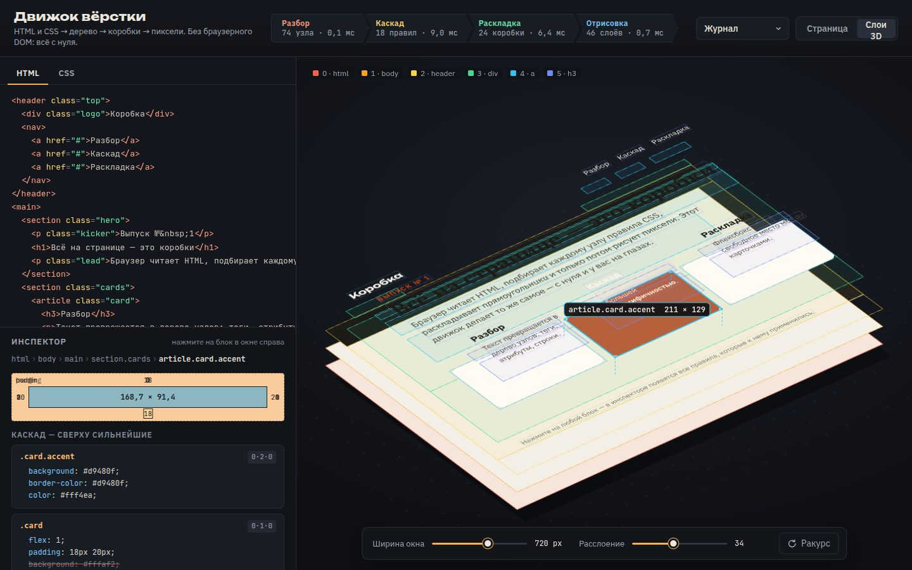

# 079 · Движок вёрстки

> Маленький браузер без браузера: HTML и CSS проходят через разбор, каскад и раскладку и превращаются в пиксели. В 3D видно, из каких коробок состоит страница.

## Как запустить
Двойной клик по `index.html`. Интернет нужен только для шрифтов: движок меряет текст реальными гарнитурами (IBM Plex Sans, PT Serif, Unbounded, JetBrains Mono). Без сети он возьмёт системные шрифты, и строки перенесутся по-другому.

## Что делать
- Правьте HTML и CSS слева — страница пересобирается на лету, в шапке видно время каждого этапа.
- **Слои 3D:** перетаскивание вращает страницу, колесо или ползунок «Расслоение» раздвигает слои. Текст парит над своим блоком — это строчные коробки.
- **Страница:** обычный вид с подсветкой margin, border, padding и содержимого, как в инструментах разработчика.
- Клик по любому блоку открывает его в инспекторе: коробочную модель, все подошедшие правила по специфичности (перекрытые зачёркнуты) и итоговые значения.
- **Ширина окна** — ползунок переразмечает страницу. В примерах «Журнал» и «Отзывчивость» срабатывают правила `@media`.
- Пять примеров: «Журнал», «Каскад», «Флексбокс», «Перенос строк», «Отзывчивость».

## Что внутри
- **Разбор HTML:** токенайзер на регулярных выражениях, сущности (`&nbsp;`, `&laquo;`…), пустые теги, неявное закрытие `
` и `<li>`, достройка `html` и `body`.
- **Разбор CSS:** правила, группы селекторов, `@media (max-width / min-width)`, `!important`. Сокращения `margin`, `padding`, `border`, `flex`, `gap`, `background` раскрываются в полные свойства.
- **Каскад:** селекторы по тегу, классам, id, `*`, потомку и `>`, `:first-child`, `:last-child`, `:nth-child()`. Специфичность (a·b·c), порядок, стили браузера по умолчанию, атрибут `style`, наследование; `em`, `rem`, `%`.
- **Раскладка:**
  - блочная — ширины, `max-width`, `margin: auto`, схлопывание вертикальных отступов между соседями;
  - строчная — перенос по словам с реальным измерением шрифта, базовые линии, `line-height`, `text-align`, ` `;
  - flex — `flex-grow`, `flex-shrink`, `flex-basis`, `justify-content`, `align-items`, `align-self`, `gap`, `flex-wrap`, направления row и column.
- **Отрисовка:** фоны со скруглениями, рамки (сплошные, пунктир, точки), текст с подчёркиванием, фоны строчных элементов (`mark`, `code`), маркеры списков, `opacity`.
- **3D:** ортографическая проекция делает каждую коробку аффинным параллелограммом. Поэтому слой рисуется тем же кодом отрисовки через `setTransform` — без WebGL и без искажений.

## Почему это про Opus 5.5
Длинная инженерная задача, где десяток подсистем должен сойтись в одну, плюс глубокое знание того, как устроен браузер. Именно такие задачи — сильная сторона модели (Terminal-Bench 4.0 — 66,4 %).

## Ограничения
- Нет `position`, `float`, `grid`, `inline-block`, картинок и псевдоэлементов.
- Нет схлопывания отступов через родителя.
- `text-align: justify` работает как выравнивание влево.
- Горизонтальные отступы строчных элементов (`padding` у `code`) рисуются, но не сдвигают текст.
- Селекторы по атрибутам и `:hover` не поддерживаются: такое правило просто пропускается.
