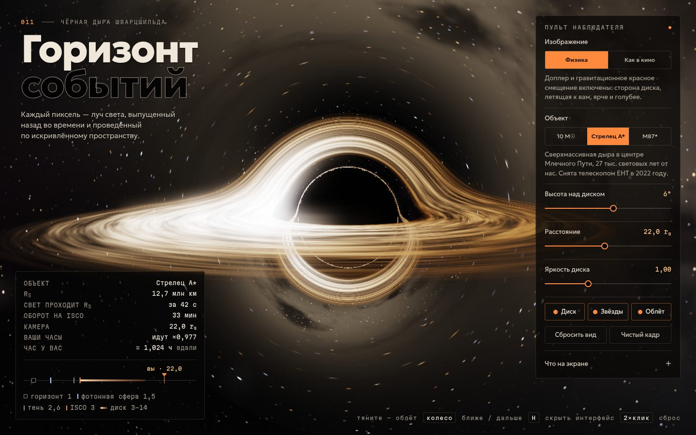

# 080 · Горизонт событий

> Чёрная дыра Шварцшильда в реальном времени: каждый пиксель — луч света, проведённый назад по искривлённому пространству.

## Как запустить
Двойной клик по `index.html`. Нужен браузер с WebGL 2 (Chrome, Safari, Firefox). Без интернета всё работает, только шрифты заменятся системными.

## Что делать
- Тянуть мышью или пальцем — облёт вокруг дыры; колесо или щипок — ближе и дальше; двойной клик — сброс вида.
- «Физика» / «Как в кино» — с доплеровским эффектом и без него (как в «Интерстелларе»).
- Объект: звёздная дыра на 10 масс Солнца, Стрелец A*, M87*. Меняются реальные масштабы в HUD и условная температура диска.
- H — спрятать интерфейс, стрелки — облёт, +/− — расстояние. «Что на экране» — пояснения к каждой детали картинки.

## Что внутри
- Нулевые геодезические Шварцшильда интегрируются во фрагментном шейдере: d²x/dλ² = −(3/2)·h²·x/r⁵, где h = |x × v| сохраняется (уравнение Бине для света). Шаг интегрирования адаптивный — мелкий у фотонной сферы, крупный вдали.
- Тонкий аккреционный диск от ISCO (3 r_s) до 14 r_s с профилем излучения T⁴ ∝ r⁻³(1 − √(r_in/r)) и кеплеровым вращением. Узор течёт с дифференциальным вращением: два слоя со сдвигом на полпериода не дают ему закрутиться до полос.
- Частотный сдвиг g = √(1 − 3M/r) / (1 − Ω·L_z) учитывает сразу гравитационное красное смещение и Доплер. Цвет — по локусу Планка (аппроксимация Кристека), яркость ∝ g⁴.
- Процедурное небо: три слоя звёзд с цветами по температуре, полоса «Млечного Пути» с пылевыми прожилками. Линза искажает его без всяких подгонок — тень, фотонное кольцо и «вторые изображения» получаются сами.
- HDR-рендер с тональной компрессией ACES и bloom. Разрешение трассировки подстраивается под частоту кадров.
- HUD считает реальные величины: r_s = 2GM/c², время пересечения r_s светом, период обращения на ISCO по часам далёкого наблюдателя, замедление времени на вашей орбите √(1 − r_s/r).

## Почему это про Opus 5.5
Междисциплинарные рассуждения (HLE — 67,7 %): общая теория относительности, релятивистская оптика и GPU-программирование сведены в одну сцену, которая остаётся физически честной.

## Ограничения
- Дыра не вращается (Шварцшильд, а не Керр); диск бесконечно тонкий, без собственной толщины и короны.
- Цвета диска условные: настоящие диски светят в ультрафиолете и рентгене, здесь спектр сдвинут в видимый диапазон.
- Камера неподвижна относительно дыры: аберрация от её собственного орбитального движения не учитывается.
- На слабых видеокартах разрешение трассировки автоматически снижается.
