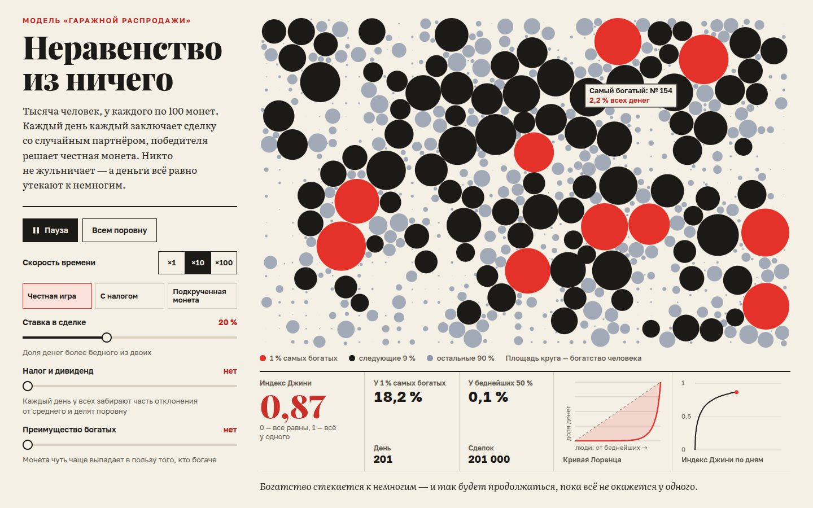

# 081 · Неравенство из ничего

> Модель «гаражной распродажи»: тысяча человек с одинаковыми деньгами каждый день честно торгуют со случайными партнёрами — и богатство всё равно стекается к немногим.

## Как запустить
Двойной клик по `index.html`. Шрифты (Playfair Display, Literata, Golos Text) грузятся с Google Fonts; без сети подставятся системные.

## Что делать
- Смотреть: модель запускается сама. Площадь круга — богатство человека, красные — 1 % самых богатых. Наведите на круг, чтобы увидеть номер и долю.
- **Пауза** (пробел), **Всем поровну** (R) и скорость ×1, ×10, ×100.
- **Сценарии**: «Честная игра», «С налогом», «Подкрученная монета».
- **Ползунки**: ставка в сделке (доля денег более бедного), налог с дивидендом (подтягивание всех к среднему), преимущество богатых (перекос монеты).
- Ниже — короткая статья: почему беднеют почти все, что меняет налог, откуда модель и чего в ней нет.

## Что внутри
- Каждый «день» — 1000 сделок. На кону f · min(wᵢ, wⱼ), победителя решает монета с вероятностью ½ + ζ·(wᵢ − wⱼ)/w̄, налог χ сдвигает каждого к среднему.
- Каждый кадр считаются индекс Джини, доли 1 % богатейших и беднейших 50 %, кривая Лоренца и история Джини.
- Круги не накладываются: каждый пружиной тянется к своему месту на сетке, а соседи его расталкивают. Пары ищутся «метёлкой» по оси x, поэтому упаковка тысячи кругов укладывается в доли миллисекунды за кадр. Площадь круга пропорциональна богатству, так что общее количество «краски» на поле не меняется.
- Числа в тексте получены этой же моделью и проверены на трёх зёрнах случайности: при ставке 20 % без налога Джини за 100 дней доходит до ≈ 0,78, за 1000 дней — до ≈ 0,97. Налог 1 % в день останавливает его около 0,58, 3 % — около 0,41–0,42. При налоге 1 % и перекосе 0,05 у 1 % богатейших почти треть всех денег (29–32 %).
- Вердикт под графиками следует порогу, найденному теми же прогонами: частичная олигархия появляется, когда перекос монеты больше налога (как в модели Богошяна).

## Почему это про Opus 5.5
Экономическая модель, объяснённая как журналистика данных: механизм, цифры, проверенные симуляцией, и честные оговорки о том, чего модель не описывает.

## Ограничения
- В модели нет производства, труда, наследства и роста — только обмен. Это иллюстрация механизма, а не прогноз для реальной экономики.
- Числа в тексте от прогона к прогону плавают в пределах 0,01–0,02 по Джини.
- Положение круга на поле ничего не значит: смысл несут только площадь и цвет.
