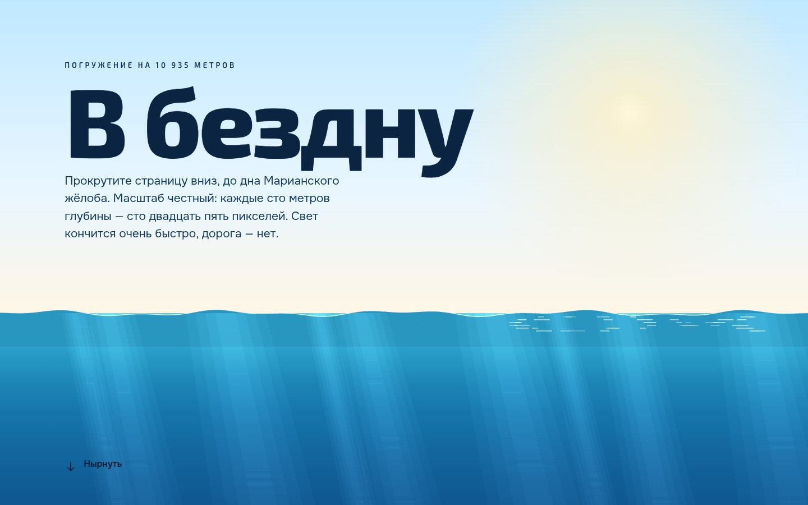

# 082 · В бездну

> Прокрутите страницу от поверхности океана до дна Марианского жёлоба: 10 935 метров в честном масштабе, 125 пикселей на каждые сто метров.

## Как запустить
Двойной клик по `index.html`. Интернет нужен только для шрифтов Exo 2, Onest и Jura.

## Что делать
- Прокручивайте вниз. Вода темнеет по зонам: солнечная, сумеречная (с 200 м), полуночная (с 1000 м), бездна (с 4000 м), зона желобов (с 6000 м).
- Справа глубиномер: глубина, давление, температура воды и доля солнечного света. Подписи зон на нём — это лифт.
- По пути, на своих настоящих глубинах, встречаются рекордсмены и обитатели: фридайвер (214 м), императорский пингвин (564 м), гигантский кальмар, адский вампир, «Комсомолец» (1027 м), удильщик, кашалот, «Титаник» (около 3800 м), «Миры» у Северного полюса (4261 м), рыба-слизень (8336 м), Кэмерон и «Триест» на дне.

## Что внутри
- Цвет воды интерполируется по логарифму глубины; красный гаснет первым, синий держится дольше всех.
- Фон — один Canvas: небо и волны на поверхности, лучи в первых ~150 м, «морской снег», который уходит вверх при погружении, вспышки биолюминесценции ниже 350 м.
- Доля света — экспонента с затуханием, при которой на 200 м остаётся около 1 %; давление — 1 атм плюс 1 атм на каждые 10 м.
- Все существа нарисованы процедурным SVG, их свет — градиенты, без растровых картинок.
- Слева в зоне желобов пунктир высотой с Эверест: поставленный на дно, он остался бы на два километра под водой.

## Почему это про Opus 5.5
Много точных фактов, собранных в одно путешествие: глубины, годы, рекорды — и короткий ясный текст к каждому.

## Ограничения
- Температура — усреднённый профиль для открытого океана; в реальных морях она сильно различается.
- Существа стилизованы и не в масштабе друг к другу; глубины показывают типичное место обитания или рекорд.
