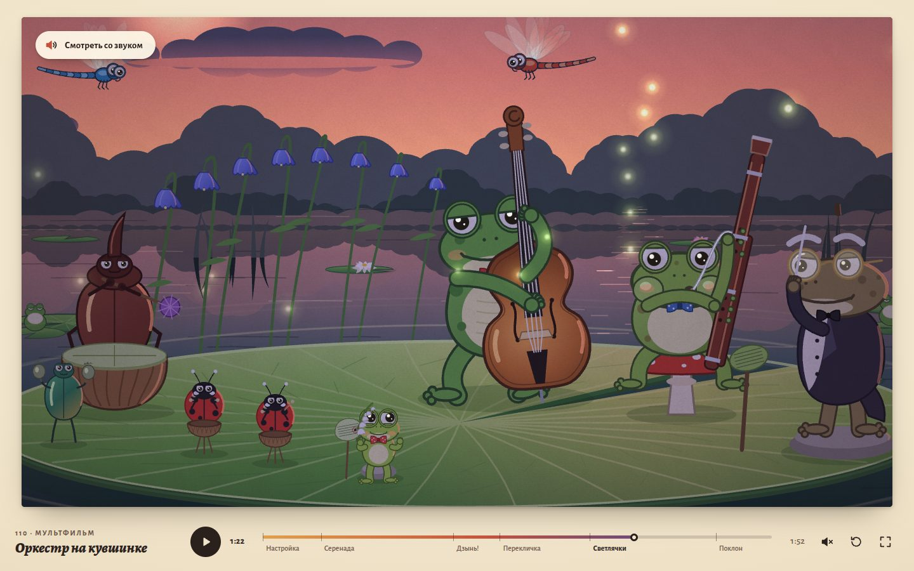

# 083 · Оркестр на кувшинке

> Музыкальный мультфильм на 1 мин 53 с: лягушонок сыграл свою единственную ноту не вовремя — и оркестр превратил ошибку в музыку.

## Как запустить
Двойной клик по `index.html`. Интернет нужен только для шрифтов Google — без сети титры и подписи набираются системными шрифтами, фильм и звук работают.

## Что делать
- Фильм начинается сам, без звука (так требуют браузеры). «Смотреть со звуком» перезапускает его с начала уже со звуком.
- Пробел — пауза, ← / → — ±5 с, Home — в начало, M — звук, F — весь экран.
- Шкала времени с метками сцен: перемотка мышью и пальцем, клик по кадру — пауза.

## Сюжет
1. **Настройка.** Оркестр настраивается на закате. Лягушонок с веточкой ландыша читает свою партию: двенадцать тактов паузы и одна нота — «в самом конце!».
2. **Серенада.** Фагот ведёт тему, жуки держат ритм. Лягушонок считает такты на пальцах рук, потом ног — и сбивается.
3. **«Дзынь!»** Оркестр берёт аккорд с ферматой, дирижёр снимает звук — и в полной тишине лягушонок звенит. Не вовремя. Все оборачиваются, ему стыдно до слёз.
4. **Перекличка.** Дирижёр улыбается и показывает: сыграй ещё. Колокольчики, контрабас, жуки и фагот по очереди отвечают на его ноту, и его мотив становится общим — вплоть до польки лягушонка.
5. **Светлячки.** Финал: тема фагота вместе с мотивом лягушонка, хор лягушек в камышах, светлячки вспыхивают на каждую долю.
6. **Поклон.** Последний аккорд, тишина — и та самая нота, теперь на своём месте. Из веточки вылетает стайка светлячков, лягушки аплодируют, колыбельная, ночь.

## Что внутри
- **Партитура — единственный источник правды** (`score.js`). Ноты записаны строками вида «F4 1.5 .7», темп и метр заданы по отрезкам, в каденции — замедление по долям. Из одного массива в 805 событий строятся и звук, и движения.
- **Музыка ведёт анимацию.** Поза каждого музыканта — функция от ближайших нот: замах перед нотой, удар ровно в момент ноты, отдача и затухающая пружина. Контрабасист переставляет руку по грифу под высоту ноты и оттягивает нужную струну, у фаготиста пальцы по аппликатуре и щёки на каждой ноте, дирижёр ведёт схему на четыре и на два, стрекозы перелетают по дугам от цветка к цветку.
- **Звук синтезируется на Web Audio.** Пиццикато — алгоритм Карплуса — Стронга, фагот — своя форма волны с формантами и вибрато, колокольчики и ландыш — аддитивный синтез, жуки — шумы и тоны, зал — свёртка с синтезированным импульсом, фоном — сверчки и вода. Планировщик ставит ноты с упреждением 0,22 с, а картинка идёт по часам AudioContext с поправкой на задержку вывода.
- **Режиссура.** 46 планов с монтажными склейками, многоплановая камера с параллаксом и смазом панорамы, цветовой сценарий «золото → закат → сумерки → ночь», вставка с листком-партией крупным планом, титры.
- **Кадр — чистая функция времени `t`**: перемотка работает в любую точку, звук переставляется вместе с тянущимися нотами.
- Всё нарисовано кодом на Canvas 2D: ни одной картинки и ни одного аудиофайла.

## Почему это про Opus 5.5
Одна программа одновременно сочиняет музыку (гармония, голоса, оркестровка), синтезирует инструменты и ставит мультфильм, где каждое движение выведено из той же партитуры, — композитор, аниматор и звукорежиссёр в одном коде.

## Ограничения
- Инструменты синтезированы, а не записаны: фагот и хор звучат игрушечно.
- Canvas 2D без WebGL: холст ограничен 2560 px по ширине, на слабом компьютере во весь экран кадры могут проседать.
- Точность синхронизации зависит от того, насколько честно браузер сообщает задержку вывода звука: в беспроводных наушниках возможен небольшой сдвиг.
- Фильм без слов: единственная надпись в кадре — пометка на листке-партии.
