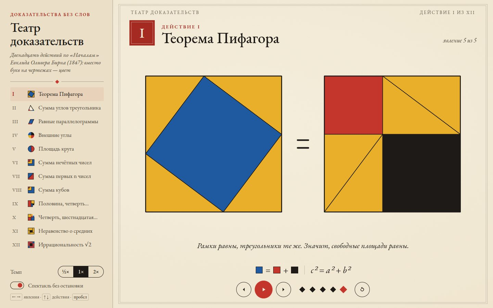

# 084 · Театр доказательств

> Двенадцать доказательств без слов, разыгранных по шагам в цветах «Начал» Евклида Оливера Бирна (1847): вместо букв на чертежах — красный, жёлтый, синий и чёрный.

## Как запустить
Двойной клик по `index.html`. Интернет не обязателен: без него шрифт EB Garamond заменится системной антиквой.

## Что делать
- Спектакль идёт сам: явление за явлением, действие за действием. Кнопка ▶/❚❚ или пробел — пауза.
- `←` `→` или кнопки по бокам — предыдущее и следующее явление, ромбики под чертежом — переход к любому явлению, ↻ — сыграть действие заново.
- `↑` `↓` или оглавление слева — другие действия. «Темп» — ½×, 1× или 2×. Переключатель «Спектакль без остановки» решает, идти ли дальше после последнего явления.
- На телефоне оглавление открывается кнопкой «Все действия», а по чертежу можно листать свайпом.

## Что внутри
- Двенадцать доказательств: теорема Пифагора перестановкой треугольников; сумма углов треугольника (Евклид, I.32); параллелограммы на одном основании (I.35); сумма внешних углов многоугольника; площадь круга через секторы; сумма нечётных чисел; сумма первых n чисел; сумма кубов (теорема Никомаха); ряды ½ + ¼ + … = 1 и ¼ + 1/16 + … = ⅓; неравенство о средних через (a + b)² ≥ 4ab; иррациональность √2 по Тенненбауму.
- Каждое доказательство — функция от непрерывной «фазы» p: p = 0 — первое явление, p = 2,4 — переход от третьего явления к четвёртому пройден на 40 %. Детали движутся по интерполяции положений и поворотов с кубическим сглаживанием, цвета меняются короткой сменой.
- Автокадрирование: при первом показе действия кисть проходит все его явления вхолостую и запоминает рамку всего нарисованного. Сцена вписывается по этой рамке, поэтому чертёж всегда крупный и по центру. На узком экране широкие чертежи (Пифагор, √2) перестраиваются столбиком.
- Типографика: неразрывные пробелы после коротких слов расставляются автоматически, числа набраны антиквой с выравненными цифрами.

## Почему это про Opus 5.5
Строгая математика и ясное объяснение: двенадцать доказательств проверены шаг за шагом, у каждого явления — одна короткая фраза, а чертёж говорит остальное.

## Ограничения
- Это наглядные рассуждения, а не формальные доказательства. Площадь круга показана на конечном числе секторов (16, затем 80) — предел только обозначен. Бесконечный спуск для √2 изображён вложенными квадратами.
- Анимация нарисована на Canvas 2D, а не SVG: так проще держать четыре цвета Бирна и тонкие линии одинаковыми на любом масштабе.
- Примеры фиксированы: катеты у Пифагора в отношении 3 : 4, шесть ступеней в лесенках, четыре куба у Никомаха. Свои значения ввести нельзя.
