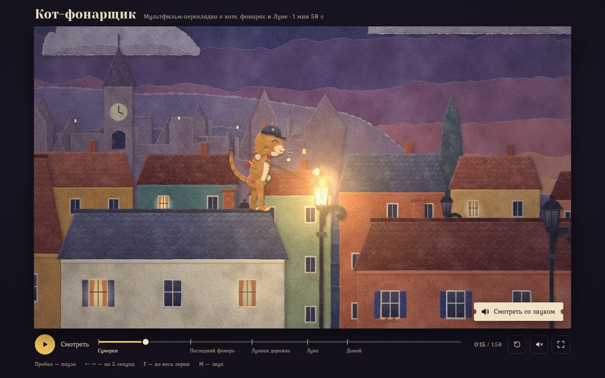

# 085 · Кот-фонарщик

> Двухминутный мультфильм-перекладка: кот каждый вечер зажигает фонари городка у моря, но последний фонарь на пристани гаснет на ветру — и кот идёт за огнём к Луне.

## Как запустить
Двойной клик по `index.html`. Фильм сразу идёт без звука, кнопка «Смотреть со звуком» запускает его с начала уже с музыкой. Без интернета работает всё, только вместо шрифтов Yeseva One и Kurale подставятся системные.

## Что делать
- «Смотреть со звуком» — фильм с начала, с вальсом и шумами.
- Пробел или жёлтая кнопка — пауза и продолжение (пробел работает, даже когда в фокусе другая кнопка плеера; её нажимает Enter).
- ← → — на 5 секунд назад и вперёд, F — во весь экран, M — звук.
- Шкала времени с метками пяти сцен: щелчок или протяжка перематывает в любую точку. На телефоне название текущей сцены написано под шкалой.

## Что внутри
- **История** в пяти сценах: «Сумерки», «Последний фонарь», «Лунная дорожка», «Луна», «Домой». Это 19 планов: общие, средние и крупные, наплывы и затемнения, наезд камеры на первый фонарь, полёт камеры сквозь планы по лунной дорожке. Каждый кадр — чистая функция от времени фильма, поэтому перемотка точная.
- **Перекладка.** Кот собран из 29 бумажных деталей на шарнирах, на суставах видны латунные заклёпки. Глаза и рты сменные, как у настоящей куклы; для крупных планов есть отдельная кукла анфас с веками и бровями. Шаг, бег и прыжок — циклы с прижимом стоп к крыше, шест к фитилю тянется обратной кинематикой лапы. У мышонка в лодке свои жесты: высматривает берег, снимает шляпу, бросает рыбу.
- **Бумага.** Каждая деталь вырезается по неровному контуру (волна ножниц и волокна), получает пятна, зерно, фаску и мягкую тень. Потом она один раз запекается в растр на процессорном холсте, под наибольший масштаб, который понадобится ей за весь фильм; этот масштаб заранее считает проход по всем кадрам.
- **Многоплановая камера.** У каждого листа своя глубина, масштаб плана — zoom / (dist + d). Море — плоскость, поэтому полосы волн сами сходятся к горизонту; дальний берег уходит под воду мысом.
- **Свет.** Сумерки и ночь — карта тьмы с «дырами» от фонарей, окон и пламени поверх сцены. Светящиеся детали (окна, огонь, Луна) рисуются на отдельный слой, который честно перекрывают предметы впереди.
- **Цена кадра.** Спрайты рисуются с простым сглаживанием, а при сильном сжатии берётся заранее уменьшенная копия. Полоса моря рисуется только до гребня ближней, крупные ореолы идут в слой в ¼ разрешения, светящийся слой обновляется только там, где есть светящиеся детали. На программном растре без видеокарты кадр от этого подешевел в 2–20 раз.
- **Звук** синтезируется Web Audio: вальс на челесте, контрабас пиццикато и арфа по алгоритму Карплуса — Стронга, «хор» Луны на формантах, стеклянные ноты шагов по дорожке, хлопки пламени, скрип ставен, зевок, ветер, море и мурлыканье. Партитура — список событий во времени фильма, поэтому звук идёт вслед за перемоткой, а в конце фильма плавно затихает.

## Почему это про Opus 5.5
Модель сама придумала историю, раскадровала её, «вырезала» кукол, поставила движение по двенадцати принципам анимации и написала музыку — одной программой, без единой картинки и аудиофайла.

## Ограничения
- Шарниры двигаются только в плоскости экрана: поворотов в три четверти нет, для крупных планов — отдельная кукла анфас.
- Освещение условное: тьма — полупрозрачная карта поверх бумаги, а не расчёт света.
- Ширина холста ограничена 1920 px: на ретине кадр чуть мягче, зато на треть меньше памяти и работы на кадр, чем при прежних 2400 px.
- Детали запекаются в первые секунды просмотра, пока идёт титр; на медленной машине в начале возможны короткие подтормаживания.
- Синтез — не запись: челеста и контрабас правдоподобны, но беднее настоящих, «мяу» собрано из формант.
- Сказка есть сказка: на самом деле Луна «худеет» из-за смены фаз, а не потому, что делится светом.
