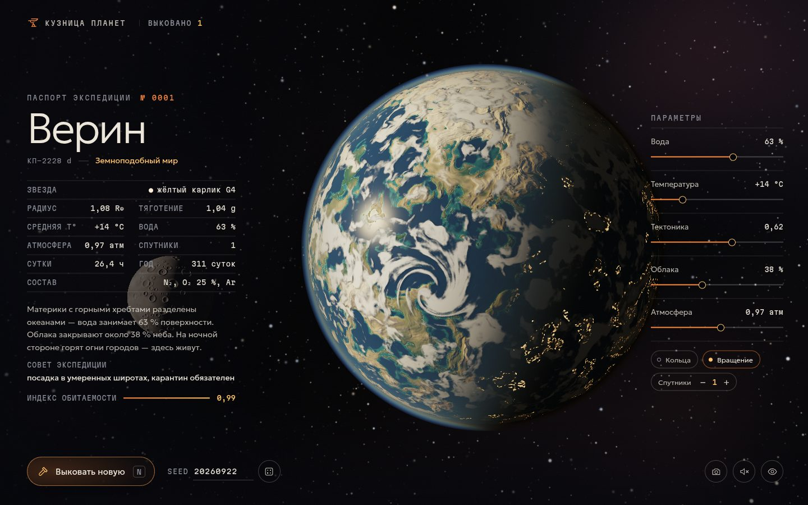

# 086 · Кузница планет

> Генератор планет: жмёте «Выковать» — мир плавится, остывает, наполняется океанами и облаками и получает паспорт экспедиции.

## Как запустить
Двойной клик по `index.html`. Нужен браузер с WebGL2 (любой свежий Chrome, Safari, Firefox). Интернет нужен только для шрифтов: без него интерфейс перейдёт на системные.

## Что делать
- **Выковать новую** (или `N`, пробел) — новая планета с «ковкой»: расплав остывает, поднимается море, проявляются облака и атмосфера.
- Ползунки справа: **вода** (точный процент поверхности), **температура**, **тектоника**, **облака**, **атмосфера** (давление в атмосферах). Класс планеты, состав воздуха, индекс обитаемости и текст паспорта пересчитываются на лету.
- Перетаскивание — вращать, колесо — приблизить; `R` — кольца, `H` — спрятать интерфейс, `S` — снимок в PNG.
- Поле **seed** воспроизводит планету; seed сохраняется в адресе страницы (`#seed=…`), так что планетой можно поделиться.

## Что внутри
- Рельеф, влажность, кратеры и облака считаются один раз на планету и «запекаются» в кубические карты: сначала грубо (128²), затем в высоком разрешении по одной грани за кадр. Размер подбирается по скорости видеокарты.
- Уровень моря не угадывается: грубая карта читается обратно на процессор, и по взвешенному квантилю высот находится уровень, при котором вода занимает ровно выбранный процент. Так же подбирается порог облачности.
- Кадр — один фрагментный шейдер: биомы по высоте, широте, влажности и местной температуре; блик на воде по Френелю; облака с тенями на поверхности; огни городов на ночной стороне; лава в разломах.
- Атмосфера — однократное рассеяние Рэлея и Ми с интегрированием вдоль луча и к Солнцу. Коэффициенты выводятся из вертикальной оптической толщины, поэтому край планеты голубеет, а терминатор краснеет сам. Отдельные режимы: парниковая жёлтая дымка, оранжевая дымка толинов.
- Газовые гиганты — полосы из анизотропного шума с вихрями-штормами и дифференциальным вращением. Кольца отбрасывают тень на планету, планета — на кольца. Спутники дают затмения.
- Паспорт — класс, состав атмосферы, совет экспедиции и описание в 2–3 предложения. Всё собирается из фактических параметров, с согласованием чисел в русском языке.

## Почему это про Opus 5.5
Процедурная генерация, физически мотивированный рендер и связный текст, который описывает именно то, что нарисовано. Это смесь 3D-сцен и сторителлинга, в которой модель сильна.

## Ограничения
- Масштаб атмосферы и расстояния до спутников художественно увеличены, иначе их не было бы видно.
- «Обитаемость» — игровая оценка по температуре, воде, давлению и типу звезды, а не научный индекс.
- Цвет растительности под разными звёздами — гипотеза, а не наблюдение.
