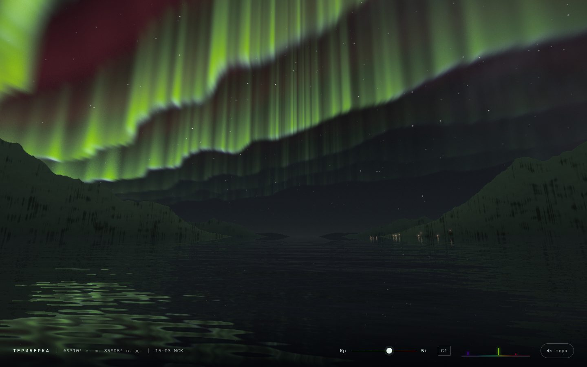

# 087 · Северное сияние над Териберкой

> Живые занавесы полярного сияния над заснеженным фьордом Кольского полуострова, отражённые в чёрной воде.

## Как запустить
Двойной клик по `index.html`. Нужен браузер с WebGL2. Без интернета всё работает, только шрифты заменятся системными.

## Что делать
- Тяните небо мышью или пальцем — осмотреться; колесо — угол обзора.
- Ползунок **Kp** или клавиши 0–9 — сила геомагнитной бури. Рядом метка шкалы NOAA (G1–G5).
- Мини-спектр справа показывает текущую яркость трёх линий излучения; наведите курсор — подсказка.
- Кнопка «звук» — синтезированный ветер и низкий гул, громче при сильной буре.

## Что внутри
- Цвет сияния не подобран на глаз: он посчитан из длины волны линий излучения (N₂⁺ 427,8 нм, O I 557,7 нм, O I 630,0 нм) через функции сложения CIE 1931 и переведён в sRGB.
- Занавесы — тонкие складчатые «стенки» вдоль силовых линий. Шейдер проходит по высоте от 94 до 330 км: зелёный кислород у нижней кромки, красный — выше 200 км, фиолетовая кайма азота появляется при сильных бурях.
- Индекс Kp смещает овал сияния: при спокойном поле дуга висит низко над морем, при сильной буре — корона в зените.
- Горы — силуэты по азимуту из периодического шума, посёлок — тёплые огни с дрожащими отражениями, вода — направленная рябь с отражением по Френелю.
- Кадры усредняются во времени (TAA), поэтому сияние гладкое без лишних выборок. Разрешение подстраивается под скорость видеокарты.
- Тонмаппинг имитирует ночное (мезопическое) зрение: в темноте цвета уходят к «палочковой» синеве — эффект Пуркинье.

## Почему это про Opus 5.5
Трёхмерная сцена, в которой физика (линии излучения, высоты свечения, геометрия овала) напрямую превращается в визуал. Ровно то, что тестеры отмечают у Opus 5.5 в работе с 3D-сценами.

## Ограничения
- Земля плоская (кривизна заменена затуханием на расстоянии), горы — силуэты, а не рельеф.
- Кинематика овала упрощена: реальное сияние зависит не только от Kp.
- Местное время посёлка — московское (UTC+3).
