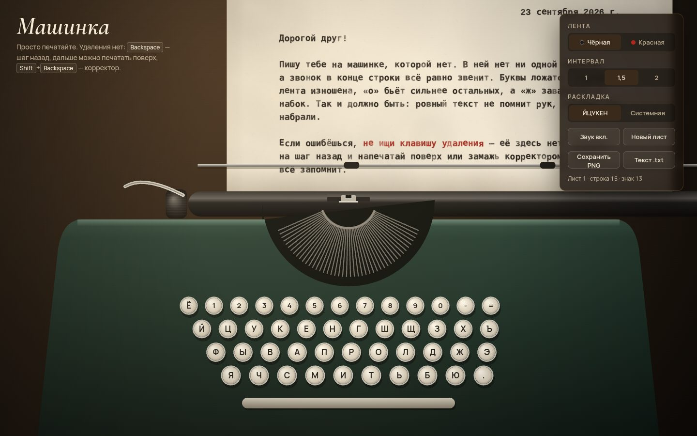

# 088 · Машинка

> Пишущая машинка в браузере: удар литеры, каретка, звонок в конце строки, неровная краска ленты. Удаления нет — только шаг назад и корректор.

## Как запустить
Двойной клик по `index.html`. При загрузке машинка сама допечатывает письмо, потом можно печатать самому. Звук включается с первым нажатием клавиши.

## Что делать
- **Печатайте.** В режиме «ЙЦУКЕН» машинка печатает кириллицу при любой раскладке компьютера — как настоящая русская машинка. «Системная» печатает то, что даёт раскладка.
- `Enter` — возврат каретки с перевод строки. `Backspace` — шаг назад без стирания: можно напечатать поверх. `Shift` + `Backspace` — корректор, белая замазка. `Tab` — пять пробелов, `↑` `↓` — прокрутка валика на полстроки.
- За 7 знаков до края звенит звонок; на краю каретка упирается.
- Справа: цвет ленты (чёрная или красная), интервал 1 / 1,5 / 2, новый лист, сохранение листа в PNG и всего текста в `.txt`.
- На телефоне коснитесь листа — откроется клавиатура.

## Что внутри
- **Каждый оттиск** рисуется отдельно:
  - случайный сдвиг и наклон литеры;
  - неравномерная краска;
  - крапинки изношенной ленты (`destination-out`);
  - иногда полуудар — одна половина бледнее;
  - растекание краски.

  Оттиски ложатся на бумагу через `multiply`, поэтому наложения темнеют, как настоящая краска.
- **У машинки свой характер:** «о» бьёт сильнее, «ж» заваливается, «е» подпрыгивает. У заглавной и строчной одна и та же литера, поэтому и дефект один.
- **Модель текста** хранит все удары в каждой клетке, так что перепечатки видны. Выгрузка в `.txt` берёт последний знак.
- **Бумага** процедурная: волокна, пятна, пожелтевшие края.
- **Каретка** уезжает влево при каждом знаке и плавно возвращается. Литерный рычаг из корзины взлетает к точке печати, лента поднимается при ударе.
- **Звуки** синтезированы Web Audio: щелчок клавиши, удар литеры, звонок из трёх частот, храповик и удар при возврате каретки, упор на краю.

## Почему это про Opus 5.5
Много маленьких деталей, которые вместе дают ощущение настоящего предмета: механика, звук, типографика, поведение. Это внимание к мелочам в интерфейсе.

## Ограничения
- Машинописный шрифт — системный Courier New (на Mac и Windows он есть и с кириллицей). Иначе берётся Cousine из Google Fonts, и вид будет чуть другим.
- Лист формата A4 при 10 знаках на дюйм, 65 знаков в строке. Поля и табуляция не настраиваются.
- Корпус и клавиатура нарисованы условно — это иллюстрация, а не модель конкретной машинки.
