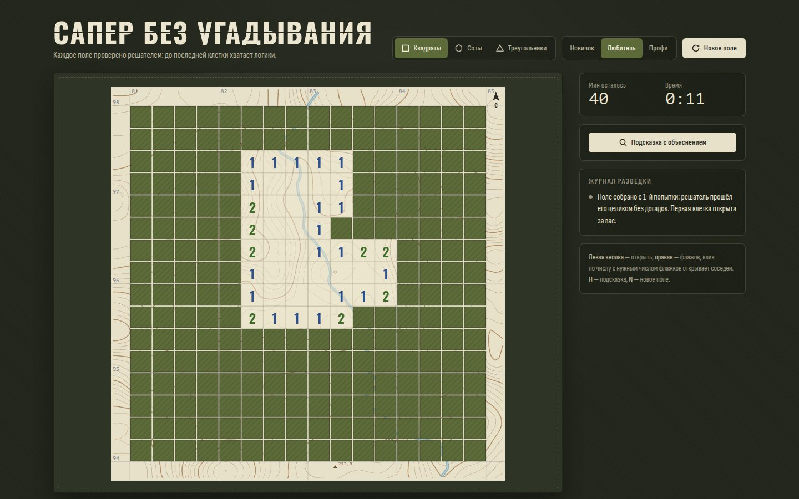

# 089 · Сапёр без угадывания

> Сапёр, в котором каждое поле решается одной логикой: генератор проверяет это решателем ещё до первого хода, а подсказка объясняет вывод словами.

## Как запустить
Двойной клик по `index.html`. Работает без интернета, только шрифты станут системными.

## Что делать
- **Левая кнопка** — открыть клетку, **правая** — флажок. Клик по открытому числу, вокруг которого уже стоит нужное число флажков, открывает остальных соседей. На телефоне: долгое нажатие ставит флажок, есть и режим «Ставить флажки».
- **Формы клеток**: квадраты (8 соседей), соты (6), треугольники (12 соседей по общим вершинам). Три уровня сложности.
- **«Подсказка с объяснением»** (клавиша **H**) подсвечивает числа-источники и вывод (зелёным — безопасно, красным — мина) и пишет рассуждение в «Журнал разведки».
- Подорвались? Журнал объяснит, как эту мину можно было вычислить.
- Открытые клетки проявляют топографическую карту: горизонтали, отметки высот, речку, километровую сетку.

## Что внутри
- **Решатель**, от простого к сложному:
  1. одно число — все закрытые соседи безопасны или все мины;
  2. пара чисел с общими клетками — оценка мин в пересечении сверху и снизу;
  3. общий счёт мин;
  4. полный перебор участков фронта (связные компоненты до 26 клеток, с отсечениями);
  5. эндшпиль — перебор всех закрытых клеток с учётом общего числа мин.
- **Генератор** в Web Worker (собран из той же функции-решателя через Blob) расставляет мины случайно и отбрасывает поля, где логика упирается в догадку.
- **Проверка корректности** в node на 450 партиях уровня «Профи»: 87 785 выводов, ни одного ошибочного. Логикой решаются 64 % случайных полей, поэтому генератору хватает 1–2 попыток.
- Соседство для всех трёх сеток вычисляется одинаково — по общим вершинам многоугольников.
- Подсказка идёт по цепочке выводов и останавливается на первом, которого ещё нет на доске. Флажок, противоречащий логике, она тоже заметит.
- Карта: шум → изолинии методом marching squares, вершины холмов с отметками, речка — спуск по градиенту.

## Почему это про Opus 5.5
Рассуждение, которое можно проверить: решатель не только находит ход, но и объясняет его человеческим языком, а корректность правил подтверждена тестами.

## Ограничения
- Порог перебора: участки фронта больше 26 клеток пропускаются (на реальных полях это редкость).
- Генератор выбирает первую клетку в центре поля и открывает её сам — так гарантируется, что цепочка логики начинается с первого хода.
