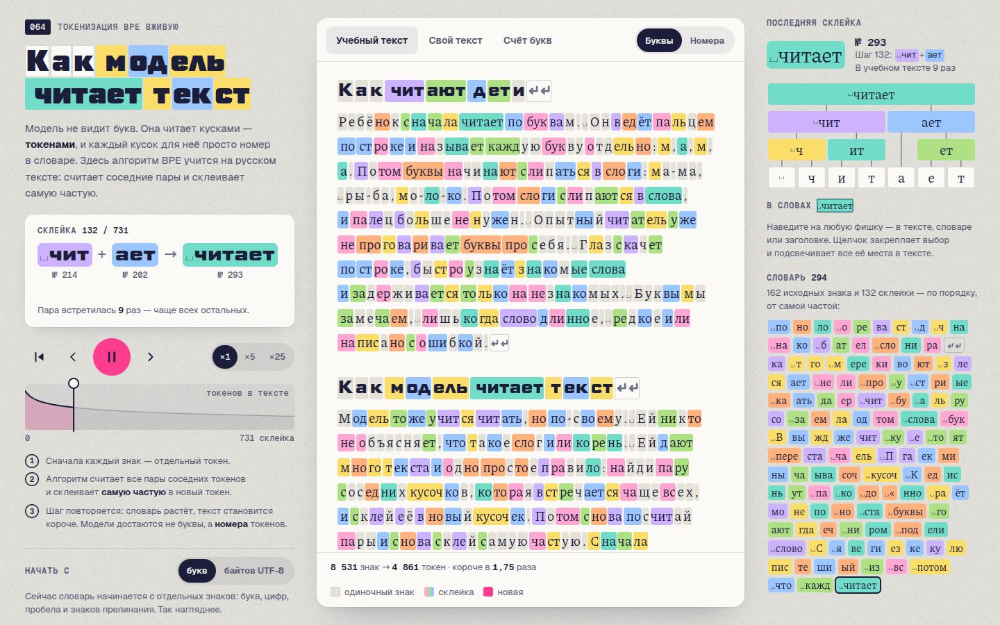

# 090 · Как модель читает текст

> Алгоритм BPE учится на русском тексте прямо в браузере — и становится видно, почему языковой модели трудно сосчитать буквы в слове.

## Как запустить
Двойной клик по `index.html`. Интернет нужен только для шрифтов (Science Gothic, Piazzolla, Geist); без него включатся системные, всё остальное работает.

## Что делать
- Смотреть: при открытии алгоритм сам делает первые 132 склейки, дальше — по одной примерно раз в секунду. Пробел — пауза, ← → — шаг (с Shift — по 10), Home и End — начало и конец, шкала слева — перемотка, ×1 / ×5 / ×25 — скорость.
- «Номера» (или клавиша N) — лист глазами модели: вместо букв номера токенов.
- Наведение на любую фишку — номер, частота, дерево склеек («из каких кусков собран») и слова, в которых токен живёт; щелчок подсвечивает все его вхождения.
- «Свой текст» — любая фраза разбивается текущим словарём. Примеры: опечатки, капс, английский, числа, длинное слово.
- «Счёт букв» — сколько «о» в «обороноспособности»: буквы против номеров токенов, кнопка «Склеивать дальше» и история слова по шагам обучения.
- «Начать с байтов UTF-8» — основа, как у настоящих токенизаторов: русская буква — два байта.

## Что внутри
- BPE с нуля: предтокенизация как у GPT-2 (пробел приклеен к началу слова, склейки не переходят границу слова), счёт пар, выбор самой частой через кучу с ленивым удалением. При равенстве частот побеждает пара с меньшими номерами, поэтому обучение детерминировано.
- Кодирование любого текста: всегда склеивается пара с самым ранним номером склейки — результат совпадает с разбиением при обучении.
- Шаги вперёд и назад инкрементальны: склейка применяется или отменяется только в затронутых словах. Вспышка новой склейки идёт волной только по видимой части листа.
- Байтовая основа: 256 исходных байтов; недособранные куски букв показаны шестнадцатеричными байтами (D0, BE…).
- Краска нового токена выбирается так, чтобы не совпасть с «родителями» и частыми соседями: одинаковых соседних фишек около 0,3 %.
- Учебный текст — 18 коротких заметок (≈ 8 500 знаков), написанных специально для проекта.

## Почему это про Opus 5.5
Модель объясняет устройство собственного «зрения»: честный алгоритм, настоящие номера токенов и прямой ответ на вопрос, почему языковой модели трудно посчитать буквы.

## Ограничения
- Учебный текст крошечный. Настоящие токенизаторы учатся на огромных корпусах, а их словари — десятки и сотни тысяч токенов. Поэтому здесь к концу обучения целиком склеиваются даже редкие слова, которые встретились всего дважды.
- Подряд идущие переводы строк — один кусок; у GPT-2 правило разбиения пробелов чуть сложнее.
- Режим «букв» — учебное упрощение: многие реальные токенизаторы работают с байтами (для сравнения есть переключатель).
- Показан только первый шаг чтения — разбиение на токены. Что модель делает с номерами дальше (векторы, внимание), проект не показывает.
