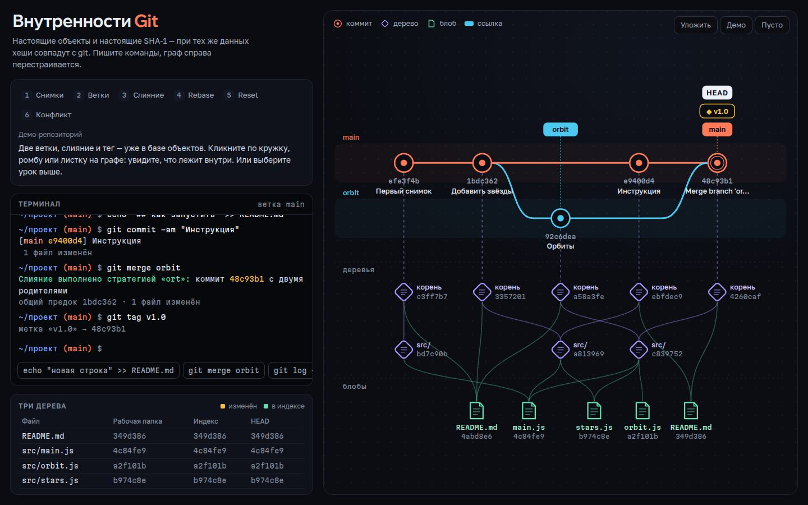

# 091 · Внутренности Git

> Терминал, в котором работают настоящие команды git, и справа — живой граф объектов: блобы, деревья, коммиты, ветки, HEAD.

## Как запустить
Двойной клик по `index.html`. Интернет нужен только для шрифтов.

## Что делать
- Пишите команды в терминале: `git init`, `echo "текст" > файл.txt`, `git add .`, `git commit -m "…"`, `git switch -c idea`, `git merge`, `git rebase`, `git reset --hard HEAD~1`, `git reflog`, `git cat-file -p HEAD`, `git gc`. `help` покажет всё; Tab дополняет, ↑/↓ — история.
- Подсказки под строкой ввода — готовые следующие шаги.
- **Уроки** (сверху): «Снимки», «Ветки», «Слияние», «Rebase», «Reset», «Конфликт» — каждый собирает нужную историю и ведёт по шагам.
- **Клик по узлу графа** открывает объект: полный SHA-1, сырое содержимое (как `git cat-file -p`), ссылки на соседние объекты кликабельны.
- Колёсико — масштаб, перетаскивание — панорама, «Уложить» — вписать граф.
- Таблица «Три дерева» показывает, чем отличаются рабочая папка, индекс и HEAD.

## Что внутри
- Свой SHA-1 и настоящий формат объектов: `blob <размер>\0…`, двоичные записи деревьев с сортировкой как в git, коммиты с `tree/parent/author/committer`. При тех же данных, авторе и времени хеши совпадают с настоящим git — проверено на эталоне (`803414b8…`).
- Модель репозитория: рабочая папка, индекс, ссылки, HEAD (в том числе отделённый), reflog, разбор ревизий `HEAD~2`, `HEAD^2`, `HEAD@{1}`, `HEAD^{tree}`, `HEAD:путь`.
- Трёхстороннее слияние с поиском общего предка и конфликтами (маркеры `<<<<<<<` в файле), перемотка вперёд, rebase с копированием коммитов, reset `--soft/--mixed/--hard`, сборка мусора.
- Граф раскладывается по слоям (коммиты по полосам веток → деревья по глубине → блобы), одинаковые объекты — один узел, поэтому видно, как Git переиспользует неизменные файлы и папки. Недостижимые объекты полупрозрачны.

## Почему это про Opus 5.5
Большая связная система «с нуля» — хеширование, модель данных, парсер ревизий, алгоритмы слияния и визуализация — ровно то, в чём модель сильна как агентный программист.

## Ограничения
- Rebase с конфликтами не поддерживается — песочница честно предлагает merge.
- Нет удалённых репозиториев, упакованных объектов и аннотированных тегов; `git gc` удаляет недостижимое сразу (в настоящем git их защищал бы reflog).
