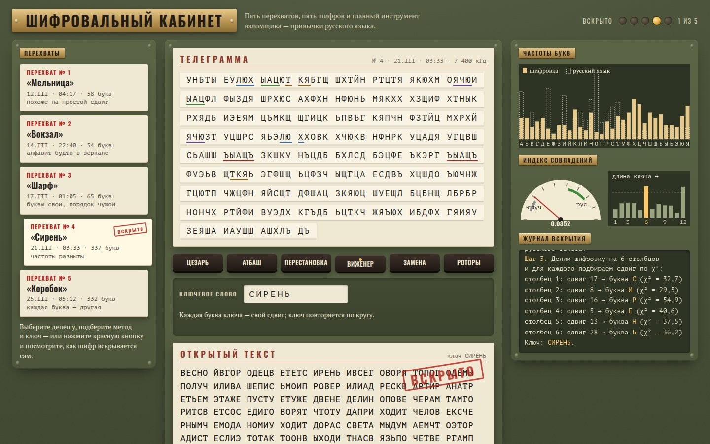

# 092 · Шифровальный кабинет

> Пять перехваченных депеш и пять шифров: Цезарь, Атбаш, перестановка, Виженер и простая замена. Красная кнопка вскрывает каждый шифр по шагам, как это делал живой криптоаналитик.

## Как запустить
Двойной клик по `index.html`. Работает без интернета, вместо шрифтов Oswald и PT подставятся системные.

## Что делать
- Выберите перехват слева и метод. Подберите ключ сами: у Цезаря — крутите диск или жмите ← →, у перестановки и Виженера — вписывайте ключевое слово, у замены — заполняйте таблицу букв.
- **Вскрыть** запускает автоматический взлом с журналом:
  - Виженер: метод Касиски (повторы подчёркиваются прямо на ленте), индекс совпадений по длине ключа, χ² для каждого столбца;
  - Цезарь: перебор 32 сдвигов с χ²;
  - перестановка: перебор ширины таблицы и порядка столбцов;
  - замена: отжиг по частотам пар букв.
- Когда открытый текст совпадёт с исходным, на бланке появится штамп «ВСКРЫТО», а в прогрессе загорится лампа. Прогресс сохраняется.
- **Свой текст** — впишите сообщение и зашифруйте его любым методом.
- **Роторы** — роторная машина: печатайте на клавиатуре (подойдёт любая раскладка), смотрите лампу и путь тока через три ротора и рефлектор. Машина симметрична: шифровка, набранная при тех же начальных положениях, расшифровывается сама.

## Что внутри
- Алфавит из 32 букв (Ё = Е). Частоты букв — по Национальному корпусу русского языка. Индекс совпадений для русского ≈ 0,0553, для случайного текста — 1/32 ≈ 0,0313.
- **Касиски:** ищутся повторы из 3–5 букв, считаются расстояния и их делители.
- **Длина ключа** — средний индекс совпадений столбцов для каждого периода от 1 до 12.
- **Столбцы** — у каждого свой сдвиг, выбирается по минимуму χ² против частот языка.
- **Простая замена** — имитация отжига: частотная догадка, затем обмены пар букв в ключе; пять заходов и жадная доводка перебором всех пар. Оценка — логарифм вероятности биграмм; модель обучена на встроенном собственном тексте о шифровальном деле. В проверке на депеше из 332 букв все 16 прогонов из 16 дали 98,8 % верных букв (ошибаются только редкие Й и Х).
- **Перестановка** вскрывается перебором ширины от 2 до 7 и всех порядков столбцов с той же оценкой пар. Хвост дополнен знаками Ъ до полной таблицы: при неполной последней строке поворот порядка столбцов даёт тот же текст со сдвигом, и оценка его не различает.

## Почему это про Opus 5.5
Задача на стыке языка и алгоритмов: частотные свойства русского, классический криптоанализ и честная проверка — все методы вскрытия прогнаны на депешах в Node до того, как попасть в интерфейс.

## Ограничения
- Роторная машина — условная, с собственной проводкой и шагом «как у счётчика»; это не копия какой-либо исторической машины. Её взлом не показан.
- Отжиг иногда путает самые редкие буквы (Й, Х, Ъ). Их легко поправить в таблице вручную.
- Все депеши, частоты и даты вымышлены. Реальны только методы и частоты букв языка.
