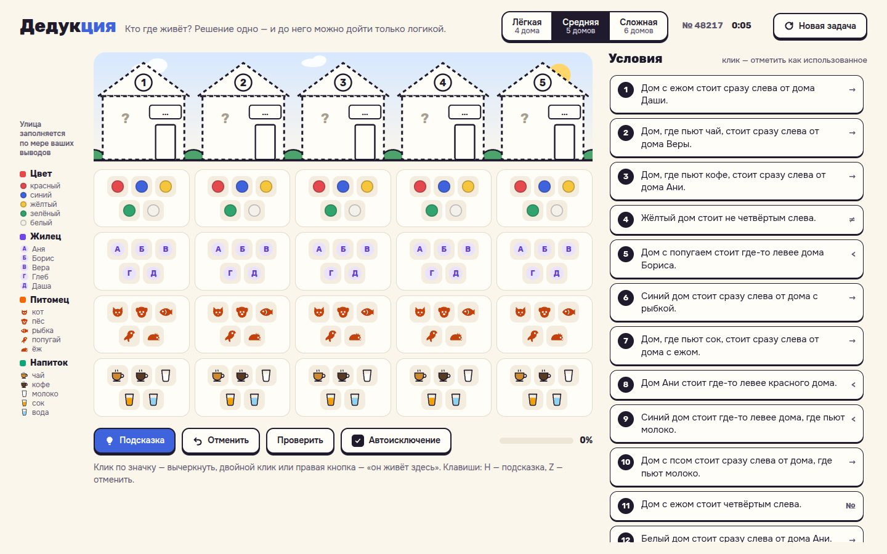

# 093 · Дедукция

> Кто где живёт? Генератор логических задач «Эйнштейна»: решение всегда одно, дойти до него можно без угадывания, а подсказка объясняет следующий шаг обычными словами.

## Как запустить
Двойной клик по `index.html`. Работает без сети (шрифты Onest и Rubik подтянутся с Google Fonts, если сеть есть).

## Что делать
- Выберите сложность: 4, 5 или 6 домов.
- **Клик** по значку — вычеркнуть вариант, **двойной клик** или **правая кнопка** — «он живёт здесь». На телефоне нажмите на клетку, откроется шторка с крупными кнопками.
- **Подсказка** (H) показывает следующий логический шаг, подсвечивает нужные клетки и условие, «Применить» делает его за вас. Если где-то ошибка, подсказка сначала найдёт её.
- **Отменить** (Z), **Проверить**, **Автоисключение**: выбранный вариант сам вычёркивается в остальных домах.
- Клик по условию помечает его как использованное. Улица сверху раскрашивается по мере ваших выводов.

## Что внутри
- Состояние — битовая маска возможных домов для каждого значения. Решатель работает теми же правилами, что и человек: прямые указания, единственный вариант в строке и в столбце, «такой же / не такой же», «сразу слева», «соседи», «где-то левее».
- Генератор строит случайное решение, набирает истинные условия (сложность меняет их веса) и останавливается, как только решатель доходит до конца без перебора. Затем выкидывает лишние условия. Логическая решаемость гарантирует и единственность решения.
- Подсказка — один шаг того же решателя, превращённый в фразу по шаблонам с падежами: «Раз кот живёт не в доме 3, то и чай пьют не в доме 3».
- Проверено в Node на 450 задачах всех уровней: каждая решается, ни один шаг подсказки не вычёркивает верный вариант.
- Прогресс сохраняется в `localStorage`.

## Почему это про Opus 5.5
Рассуждение, которое можно объяснить: решатель, генератор и русская грамматика связаны так, что каждое действие машины переводится в понятное человеку «потому что».

## Ограничения
- Четыре категории (цвет, жилец, питомец, напиток); правила решателя не используют разбор случаев, поэтому самые изощрённые задачи «Эйнштейна» он не порождает.
- Тексты условий собираются из шаблонов: они грамматически верны, но иногда звучат суховато.
