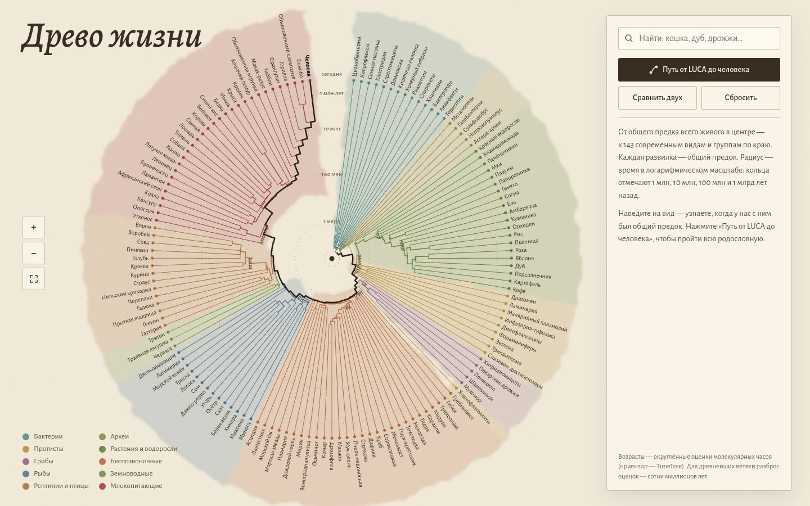

# 094 · Древо жизни

> Радиальное древо: 143 вида и группы от бактерий до человека. Радиус — время в логарифмическом масштабе, от LUCA в центре до сегодняшнего дня по краю.

## Как запустить
Двойной клик по `index.html`. Работает без интернета, только шрифты станут системными.

## Что делать
- **Наведите на вид** — подсказка скажет, когда у нас с ним был общий предок. **Клик** — карточка с родословной и отметкой общего предка на древе.
- **«Путь от LUCA до человека»** — анимированное путешествие по 30 развилкам с короткими фактами о главных вехах: эукариоты, животные, позвоночные, амниоты, млекопитающие, приматы.
- **«Сравнить двух»** — выберите два вида, например кошку и собаку (55 млн лет) или дуб и шампиньон, и древо покажет их общего предка.
- **Поиск** по русским и латинским названиям. Колесо или щипок — масштаб, перетаскивание — панорама.

## Что внутри
- Дерево записано вложенными вызовами `N(возраст, имя, …дети)` / `T(русское, латинское)`, всего 143 листа. Возрасты — округлённые оценки молекулярных часов (ориентир — TimeTree).
- Радиальная раскладка: листья равномерно по кругу, узлы — по середине дуги детей, радиус `r = R0 + (R − R0)·(1 − lg(1 + возраст) / lg(4201))`. Кольца отмечают 1 млн, 10 млн, 100 млн и 1 млрд лет.
- Акварельные размывы групп — SVG-фильтр (фрактальный шум → смещение → размытие), бумага — ещё один фильтр шума.
- Общий предок ищется через множество предков. Родословная в карточке показывает только именованные узлы.
- Современный взгляд на эукариот: они выросли из архей (асгард-архей), а не образуют отдельный «третий домен».

## Почему это про Opus 5.5
Большой массив знаний, упакованный в точную и красивую структуру, с честной пометкой о степени уверенности.

## Ограничения
- Возрасты для древнейших ветвей (бактерии, археи, ранние эукариоты) — грубые оценки с разбросом в сотни миллионов лет.
- Некоторые развилки упрощены до многоветвистых узлов (политомий), где порядок ветвления спорный или не важен для масштаба.
- Положение гребневиков и губок у основания животных до сих пор обсуждается; здесь первыми отделяются гребневики.
