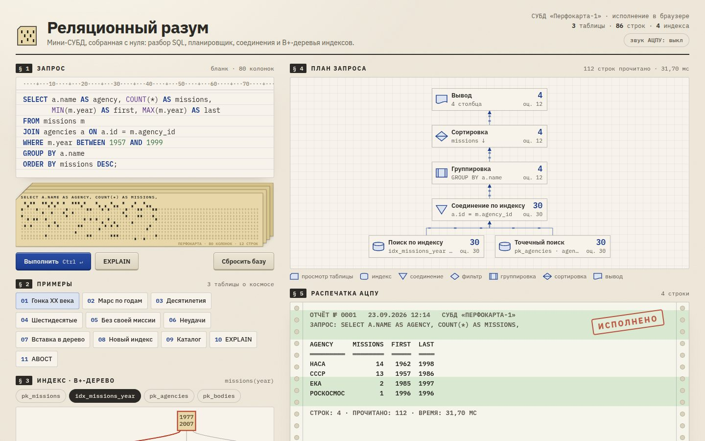

# 095 · Реляционный разум

> Мини-СУБД, собранная с нуля: SQL-запрос набивается на перфокарты, план течёт строками по блок-схеме, результат печатается на распечатке АЦПУ, а B+-дерево индекса делится на глазах.

## Как запустить
Двойной клик по `index.html`. Работает без интернета, только вместо шрифтов IBM Plex подставятся системные.

## Что делать
- Выберите пример в § 2 или напишите свой запрос в бланке § 1. **Ctrl + Enter** — выполнить, кнопка **EXPLAIN** показывает план без выполнения.
- Попробуйте «Вставка: дерево делится» — полный лист B+-дерева разделится у вас на глазах.
- «Новый индекс на глазах» строит индекс по одному ключу за такт. После этого запросы по `name` пойдут через индекс.
- Наведите на узел плана — подсказка объяснит, что делает оператор, и покажет оценку планировщика против факта.
- Ошибку в запросе СУБД покажет как АВОСТ: красная волна под ошибочным словом и строка с позицией на распечатке.
- «Сбросить базу» возвращает исходные таблицы.

## Что внутри
- **Лексер и парсер** рекурсивным спуском: `SELECT` (JOIN, LEFT JOIN, WHERE, GROUP BY, HAVING, ORDER BY, LIMIT/OFFSET, DISTINCT, CASE, IN, BETWEEN, LIKE, IS NULL), `INSERT`, `UPDATE`, `DELETE`, `CREATE TABLE/INDEX`, `DROP`, `EXPLAIN`. Трёхзначная логика с NULL, как в SQL.
- **Планировщик** проталкивает условия WHERE к таблицам и выбирает индекс по сравнению или диапазону. Для соединения выбирает поиск по индексу внутренней таблицы, хеш-соединение или вложенные циклы. Условия на правую таблицу LEFT JOIN не проталкивает — иначе исказилась бы семантика.
- **Исполнитель** считает строки на каждом узле; на схеме видно и оценку планировщика, и факт.
- **B+-дерево** — не больше 4 ключей в узле, ключ = (значение, номер строки), листья связаны в список для диапазонного чтения. Начальные индексы строятся плотной загрузкой, вставки идут с настоящим делением узлов.
- **Перфокарты** набиты в кодировке IBM 029. Для кириллицы кодировка условная: три пробивки на букву.
- **Данные** — 58 реальных космических миссий: годы запуска, агентства, цели. Есть виртуальная таблица `catalog` со схемой базы.

## Почему это про Opus 5.5
Это длинная агентная задача: СУБД из десятка взаимосвязанных частей — от лексера до визуализации плана. Опорные запросы и ошибки прогнаны в Node, прежде чем попасть в интерфейс.

## Ограничения
- Нет подзапросов, транзакций и ограничений внешних ключей. Уникальность проверяется только у первичных индексов.
- Исполнитель материализует результат каждого узла; поток строк на схеме — анимация, а не настоящий конвейер.
- `UPDATE` и `DELETE` перестраивают индексы целиком, а не по одному ключу.
