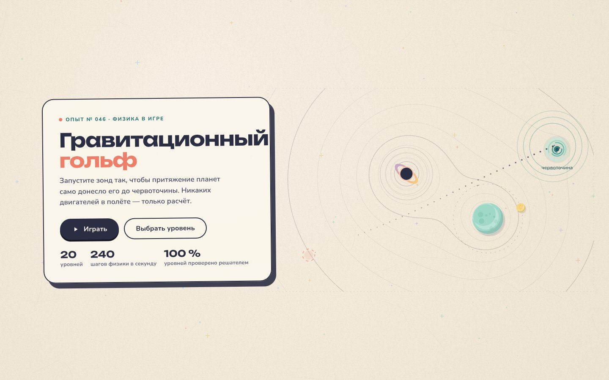

# 096 · Гравитационный гольф

> Запустите зонд так, чтобы притяжение планет само донесло его до червоточины. 20 уровней, и решаемость каждого проверена перебором.

## Как запустить
Двойной клик по `index.html`. Интернет нужен только для шрифтов.

## Что делать
- Нажмите где угодно на поле и тяните в сторону от зонда, как рогатку. Пунктир показывает первые полсекунды полёта. Отпустите — пуск.
- С клавиатуры: **←/→** — угол, **↑/↓** — сила (с **Shift** — точнее), **Пробел** — пуск, **R** — заново, **Esc** — список уровней.
- Звёзды: с первой попытки — три, до трёх попыток — две, дальше — одна. Прогресс сохраняется в браузере.

## Что внутри
- Честная ньютоновская гравитация с небольшим смягчением: интегратор «скоростной Верле», 240 шагов в секунду. Луны и двойные звёзды движутся по орбитам с момента запуска.
- Тонкие линии на бумаге — изолинии гравитационного потенциала, построенные marching squares: по ним видно, где планеты тянут сильнее.
- Игра считает полёт теми же фиксированными шагами, что и решатель, поэтому эталонные решения совпадают с тем, что видит игрок.
- Решатель в node перебрал 360 углов × 29 сил натяжения для каждого уровня. У всех 20 уровней есть решения (от 10 до 159 рабочих комбинаций), самые узкие проходы расширены. Эталонные решения сохранены в `levels.js` (`demo`), одно из них крутится на заставке.
- Звук синтезируется на лету (Web Audio) и включается только после первого действия.

## Почему это про Opus 5.5
Игровой дизайн плюс физика плюс проверка: уровни не просто нарисованы, а доказуемо проходимы — модель сама написала решатель и подкрутила уровни, где проход оказался игольным ушком.

## Ограничения
- Гравитация двумерная и «игровая»: массы подобраны для интересных траекторий, а не по реальным планетам.
- Решатель проверял сетку с шагом 1° и 6 единиц натяжения; между узлами сетки решений может быть больше.
