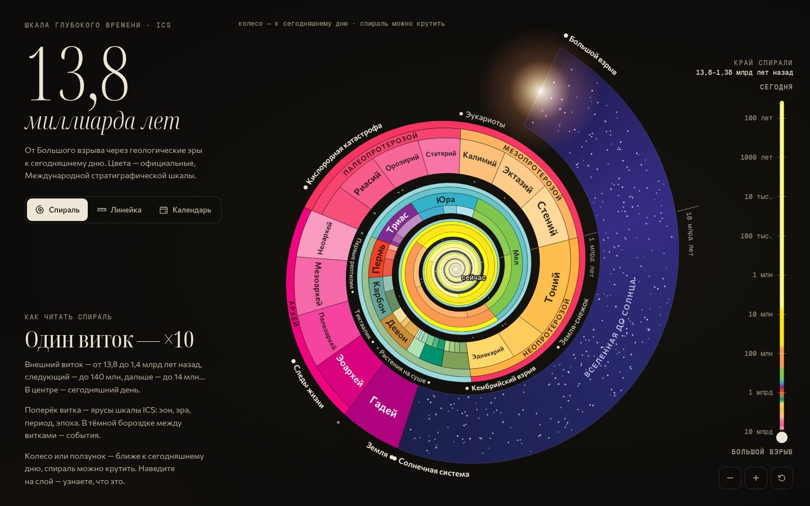

# 097 · 13,8 миллиарда лет

> Вся история, от Большого взрыва до сегодняшнего дня, в трёх масштабах: логарифмическая спираль, честная линейка и космический календарь Сагана. Цвета — официальные, Международной стратиграфической шкалы.

## Как запустить
Двойной клик по `index.html`. Интернет нужен только для шрифтов Google; без сети всё работает на системных шрифтах.

## Что делать
- **Спираль** (открывается первой): колесо, колонка глубины справа или щипок — ближе к сегодняшнему дню; спираль можно крутить мышью или пальцем. Наведите на слой — всплывут название и даты, клик — карточка с описанием.
- **Линейка**: колесо — масштаб вокруг курсора, перетаскивание — сдвиг, клик по слою — перелёт к нему; кнопки внизу — готовые масштабы от «Вся история» до «300 лет».
- **Календарь**: вся история как один год. Клик по клетке — спуск внутрь (день → час → минута → секунда → десятая доля секунды), «К полуночи» — сразу к последней клетке, «Выше» или Esc — обратно.
- В карточке любого слоя или события есть кнопки «Показать: …» — то же самое в другом режиме.
- Клавиши: 1, 2, 3 — режимы; + и − — масштаб; Esc — снять выбор.

## Что внутри
- **Данные ICS**: 4 эона, 10 эр, 22 периода и 34 эпохи с границами по Международной хроностратиграфической шкале (редакция 2022/10) и цветами CGMW — теми же RGB, что на официальной таблице. Где у ICS граница с «~», в карточке стоит «≈».
- **Логарифмическая спираль**: угол и радиус зависят от lg(лет назад) — один виток на десятичный порядок, радиус растёт в 1,72 раза за виток. Для такой спирали масштаб и поворот — одно и то же, поэтому зум выглядит как вращение, а спираль можно «крутить» рукой. Поперёк витка — ярусы эон, эра, период, эпоха; в тёмной бороздке — события. Подписи идут по дуге, расставляются по важности и подбирают кегль под место. При сильном зуме спираль уходит в круглое окно, чтобы не залезать под интерфейс.
- **Линейка**: честное линейное время с зумом от 14,6 млрд лет до 12 лет на экран. Перелёты камеры идут по траектории ван Вейка — Нёйса (сначала отдаление, потом приближение), ось сама переходит на календарные годы, миникарта показывает, какая доля всей истории сейчас на экране.
- **Календарь Сагана**: 13,787 млрд лет сжаты в 365 дней, клетка раскрашена цветами ICS пропорционально подразделениям внутри неё. Пять вложенных уровней с анимированным «входом в клетку». Все даты и выводы вроде «наш вид появился за 11 минут до полуночи» считаются из тех же данных, а не вписаны руками.
- **56 событий** — от Большого взрыва и реликтового излучения до итоговых данных «Планка» (2018): у каждого дата, описание и точное время в календаре.
- Всё рисуется на Canvas 2D, без библиотек; длинные русские слова в клетках календаря переносятся по слогам.

## Почему это про Opus 5.5
Проект держится на точности: больше сотни дат из космологии, геологии, палеонтологии и истории сведены в одну согласованную систему, где любая ошибка сразу видна по положению на шкале.

## Ограничения
- Границы ICS — по редакции 2022/10; в более новых редакциях отдельные палеозойские границы могут быть уточнены на 1–2 млн лет. Погрешности границ (у палеозойских — до ±3 млн лет) не показаны.
- Многие события датированы приблизительно и помечены «≈»: первые звёзды, первые эукариоты, выход из Африки известны с большим разбросом.
- Космическая часть (до Солнечной системы) в ICS не входит — её цвета условные.
- Календарь построен на 13,787 млрд лет (данные «Планка»), поэтому даты чуть отличаются от классического варианта Сагана, где возраст Вселенной был 15 млрд лет.
- Внутри голоцена ICS выделяет три яруса; здесь они не показаны.
