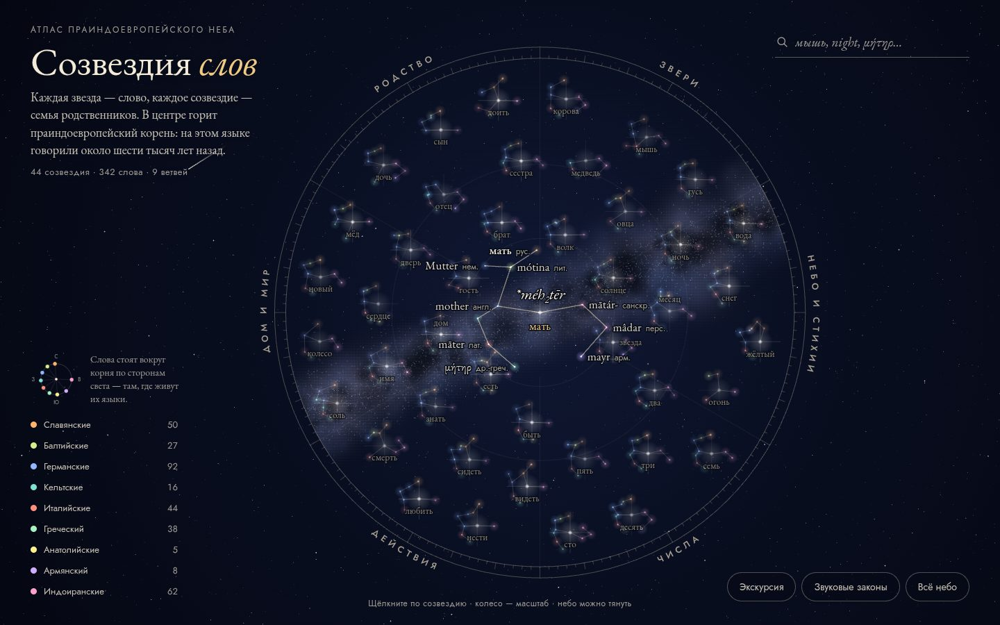

# 098 · Созвездия слов

> Звёздная карта этимологии: слова — звёзды, семьи родственных слов — созвездия, в центре каждого горит праиндоевропейский корень.

## Как запустить
Двойной клик по `index.html`. Без интернета всё работает, только вместо шрифтов EB Garamond и Jost подставятся системные — греческие и санскритские слова тогда могут выглядеть беднее.

## Что делать
- Щёлкните по созвездию или его подписи: камера подлетит, от корня по линиям побегут искры и зажгут всех родственников, справа откроется карточка семьи.
- Колесо мыши или два пальца — масштаб, перетаскивание — обзор. При приближении проявляются праиндоевропейские корни, затем сами слова.
- Поиск понимает русский, английский, латынь и греческий без ударений: «мышь», night, «μητηρ». Клавиша `/` — сразу в поиск.
- **Звуковые законы**: закон Гримма, сатэм и кентум, переход s → h. Пары слов соединяются дугами прямо на небе, каждую пару можно открыть щелчком.
- Легенда фильтрует ветви: например, подсветит все кельтские слова атласа.
- **Экскурсия** проводит по семи самым интересным семьям.

## Что внутри
- 44 семьи и 342 слова из 14 языков девяти ветвей. Только хрестоматийные этимологии; спорные места оговорены прямо в карточке («гусь», латинское lupus).
- Небо — круглая карта-планисфера: шесть областей по ободу, «мать» в центре. Созвездия расставлены релаксацией — отталкиваются друг от друга, не покидая своей области.
- Слова стоят вокруг корня по сторонам света — примерно там, где живут их языки: германские на северо-западе, индоиранские на востоке. Роза ветвей в легенде показывает схему.
- Линии созвездия — минимальное остовное дерево, «зажигание» бежит от корня по этому дереву в ширину.
- Подписи раскладываются жадным алгоритмом с приоритетами (фокус, законы, наведение, названия созвездий, корни, слова) и не наезжают друг на друга и на интерфейс. Созвездие в фокусе «раскрывается», чтобы слова поместились даже на общем плане.
- Нижние индексы ларингалов (h₁, h₂, h₃) и слоговые сонанты с кружком (l̥, n̥) рисуются вручную: в веб-шрифтах этих знаков нет.

## Почему это про Opus 5.5
Многоязычие и точность: нужно знать сравнительно-историческое языкознание, не выдумывать родство и честно отмечать спорные места — а потом превратить таблицу когнатов в живое небо.

## Ограничения
- Реконструкции даны в одной распространённой записи; у разных школ они немного отличаются.
- Для персидского, армянского и санскрита показана латинская транслитерация, а не родное письмо.
- Сорок четыре семьи — выборка из сотен надёжных, а не словарь. Положение созвездий на небе условно.
- «Стороны света» у слов — стилизация, а не географическая карта.
