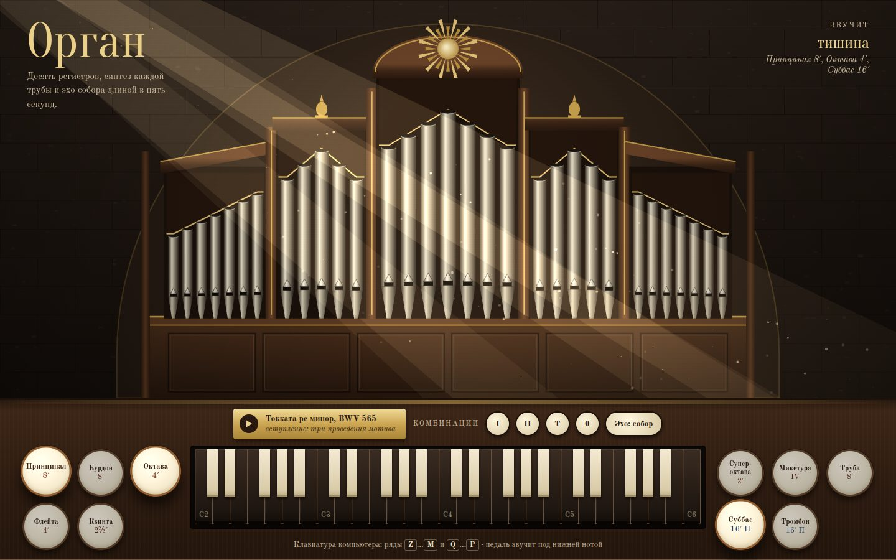

# 099 · Орган

> Духовой орган в браузере: десять регистров, каждая труба синтезирована, а эхо собора длится пять секунд.

## Как запустить
Двойной клик по `index.html`. Звук включается при первом нажатии. Без интернета работает всё, вместо шрифтов Oranienbaum и Old Standard TT подставятся системные.

## Что делать
- Играйте мышью, пальцем или на клавиатуре компьютера. Нижний ряд `Z`…`M` — октава от «до» малой, верхний `Q`…`P` — от «до» первой. Раскладка не важна.
- Вытягивайте рукоятки регистров. Если держать ноту и вытянуть регистр, новый ряд труб вступит сразу, как на настоящем органе.
- Комбинации: **I** — тихо (Бурдон 8′ и Флейта 4′), **II** — хор принципалов, **Т** — полный орган, **0** — снять всё.
- **Эхо** переключает акустику: собор (хвост 5 секунд), зал или сухой звук.
- Табличка «Токката ре минор» играет вступление: три проведения знаменитого мотива, каждое на октаву ниже, и педальное «ре».
- Звучащие трубы на фасаде загораются.

## Что внутри
- Каждый регистр — свой тембр через `PeriodicWave`:
  - Принципал — богатый ряд обертонов;
  - Бурдон — закрытая труба, почти одни нечётные гармоники;
  - Флейта — мягкая;
  - Труба — язычковая, яркий спектр за фильтром.
- Микстура — четыре ряда (2⅔′, 2′, 1⅓′, 1′) с «переломами»: высокие ряды возвращаются на октаву вниз, как в настоящих микстурах.
- У лабиальных труб есть «чифф» — короткий шумовой призвук атаки на гармонике.
- Педаль 16′ берёт нижнюю звучащую ноту октавой ниже: Суббас и Тромбон.
- Акустика собора — свёртка с синтезированной импульсной характеристикой. Длина 5,2 с, высокие частоты затухают быстрее, есть ранние отражения.
- Фасад рисуется процедурно: пять полей труб с «митрами» губ, золочёная резьба, солнце над центральной башней, лучи из высокого окна и пыль в них.

## Почему это про Opus 5.5
Звук требует знания устройства органа (регистры, футы, микстуры, педаль) и цифровой обработки сигнала. Визуал — процедурная иллюстрация без единой картинки.

## Ограничения
- Это синтез, а не запись настоящих труб: тембры правдоподобны, но проще живых.
- Из Токкаты звучат только вступительные такты — дальше пьеса не приводится.
- Одна трубка фасада обозначает высоту звука условно: настоящие фасадные трубы относятся к одному-двум регистрам.
