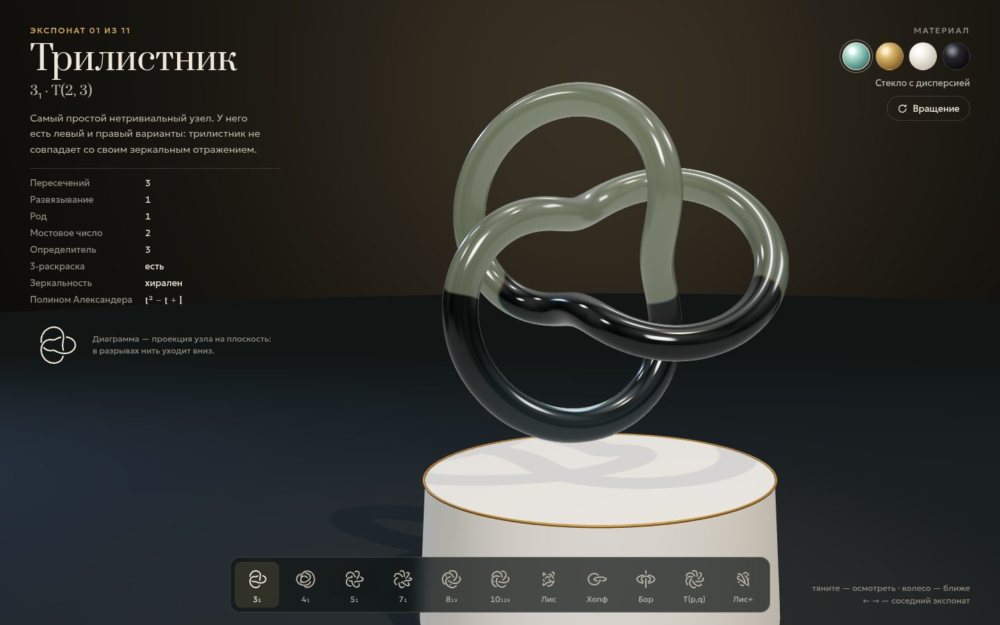

# 100 · Лаборатория узлов

> Музей математических узлов: стеклянные и латунные экспонаты на подставках, настоящие инварианты и конструктор торических узлов и узлов Лиссажу.

## Как запустить
Двойной клик по `index.html`. Нужен интернет: трёхмерная сцена использует three.js с CDN jsDelivr. Без сети страница покажет понятное сообщение.

## Что делать
- **Полка внизу** — 11 экспонатов: трилистник, восьмёрка, 5₁, 7₁, T(3, 4) = 8₁₉, T(3, 5) = 10₁₂₄, узел Лиссажу, зацепление Хопфа, кольца Борромео и два конструктора. Стрелки ← → листают.
- **Тяните мышью** — осмотреть экспонат, колесо — приблизить; «Вращение» включает и выключает медленный поворот.
- **Материалы** справа: стекло с дисперсией (радуга в гранях), полированная латунь, глазурованный фарфор, обсидиан с радужной плёнкой.
- **Конструктор T(p, q)**: при общем делителе p и q узел превращается в зацепление из НОД(p, q) петель — табличка это объяснит.
- **Конструктор Лиссажу**: частоты и фазы; если частоты не попарно взаимно просты, кривая вырождается, и табличка об этом предупредит.
- Переход между однокомпонентными экспонатами — морфинг: трубка честно проходит сквозь себя. Подпись напоминает, что настоящий узел так без разреза не переделать.

## Что внутри
- Кривые: торические узлы `((2 + cos qt)·cos pt, (2 + cos qt)·sin pt, −sin qt)`, классическая параметризация восьмёрки, трёхмерные фигуры Лиссажу; для торических зацеплений — компоненты qφ − pθ ≡ 2πk/d.
- Инварианты торических узлов считаются формулами, а не берутся из таблицы: число пересечений min(p(q−1), q(p−1)), род и число развязывания (p−1)(q−1)/2 (теорема Кронхаймера — Мрувки), мостовое число min(p, q), полином Александера `(t^{pq} − 1)(t − 1) / ((t^p − 1)(t^q − 1))` делением многочленов, определитель |Δ(−1)| и 3-раскрашиваемость.
- Диаграмма узла в табличке и на миниатюрах строится по-настоящему: ищутся пересечения проекции, нижняя нить разрывается.
- Морфинг: кривые перевыбираются равномерно по длине, затем подбираются сдвиг начала и направление обхода с минимальным путём точек.
- Сцена: three.js, физические материалы (пропускание, дисперсия, иридесценция, лак), мягкие тени от прожектора, окружение RoomEnvironment.

## Почему это про Opus 5.5
Топология, алгебра многочленов и трёхмерная графика в одном экспонате, причём с честностью в мелочах: у каждого факта на табличке есть формула или проверяемый источник.

## Ограничения
- Для узлов 5₂, 6₁ и других нетторических узлов таблицы нет надёжной параметризации, поэтому их нет на полке.
- Инварианты для узла Лиссажу из конструктора не вычисляются: определить тип узла по кривой — отдельная сложная задача.
- Морфинг между узлами топологически невозможен без самопересечений — это показано нарочно.
